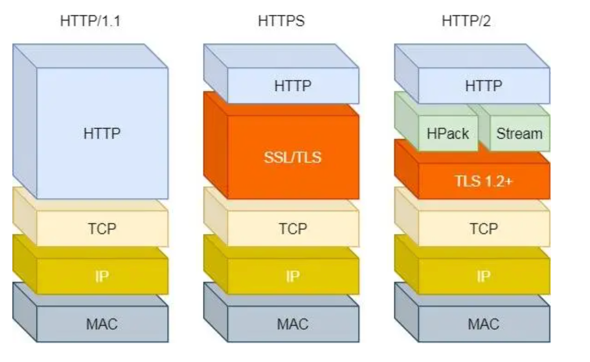

# HTTP 协议相关面试题

## 常见的 HTTP 请求方法

- `GET` 方法：用于向服务器获取数据。只读取数据，不更改任何数据。相同的参数返回的结果相同
- `POST` 方法：提交一个实体（payload），用于创建新的实体和修改现有的实体。会更改状态或引起其他的副作用
- `PUT` 方法：用新的实体替换指定的资源。PUT 请求中发送的数据完全替换了指定的资源，并且如果指定的资源不存在，则创建一个新的资源。
- `DELETE`：删除指定的资源。DELETE 请求负责删除指定的资源
- `PATCH`：通过局部修改的方式更新指定的资源。PATCH 请求类似于 PUT 请求，但是它**只更新指定资源的某些部分，而不是完全替换。**
- `HEAD`：与 GET 请求相同，但不返回响应正文。HEAD 请求可以**检查服务器是否支持指定的资源类型**、检查文件是否存在以及获取与资源有关的元数据
- `OPTIONS`：列出对指定资源所支持的请求方法、标头和其他信息。OPTIONS 请求可用于**确定服务器支持哪些请求方法**，或者客户端可以在不实际执行操作的情况下测试服务器性能或配置。

## get 和 post 的区别

:::tip
首先它们的**应用场景**不同，get 请求一般用于访问服务器资源，而 post 请求一般用于向服务器提交数据。本质的区别就是 post 会修改服务器的数据，而 get 不会修改服务器的数据。

同时 get 请求的**数据**会被放在 url 中，而 post 请求的数据会被放在请求体中。也因此 get 请求发送数据的**长度**有限制，同时**安全性**也会比 post 请求要差一些。

而且浏览器一般会**缓存** get 请求的数据，而不会缓存 post 请求的数据。

最后在网络层面，get 请求会产生一个 TCP 数据包，而 post 请求会产生**两个 TCP 数据包**，先发送 header 服务器响应 100 后，再发送 data
:::

- **应用场景不同**：get 请求不会对服务器的资源产生影响，而 post 请求会对服务器的资源产生影响，比如说 post 请求会修改服务器的数据，而 get 请求不会修改服务器的数据。
- **数据传递方式也不同**：get 请求的数据会被放在 url 中，而 post 请求的数据会被放在请求体中。
- **请求长度不同**：浏览器对 url 的长度有限制，因此 get 请求发送数据的长度有限制，而 post 请求没有这个限制。
- **缓存不同**：浏览器一般会缓存 get 请求的数据，而不会缓存 post 请求的数据。
  - 可以在请求头中添加 `Cache-Control: no-cache` 来禁止浏览器缓存 get 请求的数据
  - 也可以通过在 url 中添加随机数来禁止浏览器缓存 get 请求的数据
- **安全性不同**：get 请求的数据会被放在 url 中，因此 get 请求的数据不安全，而 post 请求的数据会被放在请求体中，因此 post 请求的数据相对安全一些。
- post 支持更多的数据类型的数据
- **产生 TCP 数据包数量不同**：get 请求会产生一个 TCP 数据包，而 post 请求会产生**两个 TCP 数据包**。
  - GET 请求，浏览器会把 HTTP header 和 data 一并发送出去，服务器响应 200（返回数据）
  - POST 请求，浏览器先发送 header，服务器响应 100 continue，浏览器再发送 data，服务器响应 200 ok（返回数据）
    - 第一次将 header 发送，确认服务器和网络都可以接收数据，才会发送 data

## post 和 put 的区别

:::tip
put 请求是**幂等的**，用于**更新数据**，而 post 请求不是幂等的，用于**添加数据**
:::

- put 向服务器发送数据，不会增加数据的种类，无论发送多少次，都只会修改数据，可以理解为更新数据
- post 向服务器发送数据，会增加数据的种类，每次发送都会增加一条数据，可以理解为添加数据

## （追问）那么用 put 请求来添加数据会有什么问题吗？

:::tip
PUT 请求本质是一个**幂等请求**，也就是多次发送相同的数据，服务端的响应应该是一样。那么用来添加数据就会造成不一致，同时也有可能 PUT 添加的数据已经存在，就会更新数据，造成**资源冲突**的问题

而且用 PUT 请求来添加数据，也**不符合 HTTP 协议的语义**，就比如你用 GET 请求来修改数据，这样也是不符合语义的，而且 GET 还有可能会被**浏览器缓存**。
:::

- **幂等性问题**：PUT 请求是幂等操作，也就是重复进行多次，并不会产生任何影响，具有替换更新的特性，也就是说请求到达服务器后必须保证数据一致性。
- **资源冲突问题**：如果使用 PUT 请求添加的数据已经存在，则需要按照 PUT 请求中提供的数据进行替换，这可能会导致数据不一致。如果在 PUT 请求的场景下添加数据，需要考虑通过不同的方式进行数据添加并返回对应的状态码
- **安全性问题**：使用 PUT 请求添加数据时，需要注意对客户端所提交的数据进行校验，以保证数据的完整性和安全性。

## 对 Accept 系列字段了解多少？

:::tip
在向服务器发出请求时，可以使用 Accept 请求头来告诉服务器，客户端希望接收什么类型的响应数据。服务器会**根据 Accept 请求头的值来决定返回什么类型的响应数据**。

比如 指定 HTML 还是 XML 格式，可以使用 Accept: text/html 或者 Accept: text/xml 来指定，如果不指定，则默认返回 HTML 格式的数据。

如果希望使用字符集来指**定响应数据的编码格式**，可以使用 Accept-Charset 字段，比如 Accept-Charset: utf-8，如果不指定，则默认使用 ISO-8859-1 字符集。

如果希望使用语言来指定**响应数据的语言**，可以使用 Accept-Language 字段，比如 Accept-Language: en，如果不指定，则默认使用 en-US 语言。

如果希望使用编码来指定**响应数据的编码格式**，可以使用 Accept-Encoding 字段，比如 Accept-Encoding: gzip，如果不指定，则默认使用 identity 编码。

:::


## 常见的 content-type 有哪些？

1. `application/x-www-form-urlencoded` 按照 `key=value&key=value` 进行编码

2. `multipart/form-data` 通常用表单上传文件

3. `application/json` 服务器消息主体是**序列化的 JSON 字符串**

4. `text/xml` 主要提交xml格式数据

## 对于定长和不定长的数据，HTTP 是怎么传输的？

:::tip
如果是定长数据，则可以通过设置 `Content-Length` 头部来告诉服务器要发送的数据长度，并且在发送完指定长度的数据后，**服务器可以直接断开连接**。这样避免了服务器等待数据传输完毕后才关闭连接，从而节省了服务器资源。

如果是不定长的数据，可以通过 Transfer-Encoding: chunked 来告诉服务器采用**分块传输给客户端**，这样做的好处是在传输大文件时可以实时传输，避免了一次性传输大文件带来的数据阻塞和等待时间过长的问题
:::

对于定长的比较的简单，发送的时候设置 `Content-Length` 头部，接收的时候读取 `Content-Length` 头部，然后读取指定长度的数据就可以了。

需要介绍一下不定长的包体传输

```json
Transfer-Encoding: chunked
```

表示分块传输数据，设置这个字段后，会自动产生两个效果

1. 忽略 Content-Length 字段
2. 基于长连接连续传输数据

```json
chunk长度(16进制的数)
第一个chunk的内容
chunk长度(16进制的数)
第二个chunk的内容
......
0
```

最后有一个**空行**！

## HTTP 如何处理大文件的传输？

:::tip
第一种可以使用**分块传输**，使用 Transfer-Encoding: chunked 头部告诉服务端，将文件分成多个块，每个块发送前会将大小发送给客户端，客户端进行拼接，直到接收所有块。

还可以使用**断点续传**的方式，这个方案依赖于 Range，可以将大文件分成多个块，客户端可以再请求时通过 Range 头部，来指定获取文件的某一部分，从而实现断点续传，这样也可以避免网络不稳定导致传输中断

最简单的还可以使用**CDN 进行加速**，使用 CDN 可以提高大文件传输效率

:::

## （追问）分块传输的 chunked 大小由什么决定？

:::tip
块的大小是可以根据**传输数据的具体情况和网络状况**进行调整的。
:::

chunked 的大小由服务器决定，一般是根据**网络环境来决定的**，比如网络环境不好，可以设置较小的 chunked 大小，这样可以保证数据传输的稳定性，如果网络环境好，可以设置较大的 chunked 大小，这样可以提高传输效率。

## （追问）在分块传输中，如果某个 chunk 传输失败了，如何处理？

当发生中断或者数据丢失时，接收方可以通过发送一个带有 `Range` 或者 `If-Range` 字段的 HTTP 请求来**获取缺失的数据块**。

其中 `Range` 字段可以指定请求所需的数据块的范围

`If-Range` 字段则可以指定**缺失数据块的版本号或数据校验值**，以便发送方能够了解接收方需要的数据块的情况。

```js
xhr.onerror = function () {
    // 下载出错，利用历史下载数据重新启动下载任务
    var lastByte = xhr.response.length;
    console.log('Download interrupted, restarting from byte ' + lastByte);
    xhr.open('GET', 'http://your-download-url.com', true);
    xhr.setRequestHeader('Range', 'bytes=' + lastByte + '-');

    xhr.send();
};

// 开始分块传输任务
xhr.open('GET', 'http://your-download-url.com', true);
xhr.setRequestHeader('Range', 'bytes=0-1023'); // 设置下载范围为前1024字节
xhr.send();
```

主要利用 onerror 事件来检测下载中断点，然后重新发送请求，设置 Range 头部，指定从哪个字节开始下载。

## （追问）如何实现断点续传呢？

断点续传指的是再文件传输过程中，由于传输中断，再次请求资源时，可以从中断处继续传输，而不是重新传输整个文件。

再 HTTP 中，断点续传一般通过 Range 头部来实现：

1. 客户端发送 GET 请求，增加 Range 头部，指定需要请求哪一部分的资源，比如
   1. `Range: bytes=0-499` 表示请求 0 到 499 字节的数据
2. 服务器再收到带有 Range 头部的 GET 请求后，会解析头部内容，从文件指定位置开始传送数据
3. 服务器传送指定范围内的数据给客户端，然后在响应头部中增加 `Content-Range` 字段，指定服务器发送的数据内容范围
   1. 如 `Content-Range: bytes 0-9999/20000`，则表示当前传输了0-9999共10000个字节，文件总大小为20000个字节。
4. 客户端在接收到响应后，将收到的**数据添加到本地缓存**中，然后通过开启**多线程**实现同时请求其他数据块的传输，并将每次请求收到的数据块进行拼接，最终获得完整的文件内容。

**Range 字段拆解**

而对于客户端而言，它需要指定请求哪一部分，通过Range这个请求头字段确定，格式为 `bytes=x-y`。接下来就来讨论一下这个 Range 的书写格式:

- `0-499` 表示从开始到第 499 个字节。
- `500-` 表示从第 500 字节到文件终点。
- `-100` 表示文件的最后100个字节。

服务器收到请求之后，首先验证范围是否合法，如果越界了那么返回 **416 错误码**，否则读取相应片段，返回 **206状态码**。

同时，服务器需要添加 `Content-Range` 字段，这个字段的格式根据请求头中 Range 字段的不同而有所差异。

具体来说，请求单段数据和请求多段数据，响应头是不一样的。

```json
// 单段数据
Range: bytes=0-9
// 多段数据
Range: bytes=0-9, 30-39
```

**单段数据**

```json
HTTP/1.1 206 Partial Content
Content-Length: 10
Accept-Ranges: bytes
Content-Range: bytes 0-9/100

i am xxxxx
```

**多段数据**

```json
HTTP/1.1 206 Partial Content
Content-Type: multipart/byteranges; boundary=00000010101
Content-Length: 189
Connection: keep-alive
Accept-Ranges: bytes


--00000010101
Content-Type: text/plain
Content-Range: bytes 0-9/96

i am xxxxx
--00000010101
Content-Type: text/plain
Content-Range: bytes 20-29/96

eex jspy e
--00000010101--
```

这个时候出现了一个非常关键的字段 `Content-Type: multipart/byteranges;boundary=00000010101`，它代表了信息量是这样的:

- 请求一定是多段数据请求
- 响应体中的分隔符是 `00000010101`

## （追问）多线程下载的原理是什么？怎么实现呢？

:::tip
将一个大文件**分割成若干个小块**，在**不同的线程中分别下载不同的小块数据**，以缩短文件下载的时间。**每个线程都独立下载一部分数据**，当所有线程下载完成后，将所有小块数据**合并**成一个完整的文件，从而实现多线程下载。
:::

1. 将要下载的文件**分成若干个小块**，以便分别在不同的线程中下载。

2. 创建线程池，根据需要下载的文件块数开启相应数量的线程。线程数和线程池大小的选择对下载速度和系统资源等都有一定的影响，需要根据实际情况进行调整。

3. 在每个线程中使用 HTTP 协议向服务器发起下载请求并获取数据。在请求中需要**指定下载开始和结束的位置**，以便只下载需要的文件块。

4. 将每个线程下载得到的文件块数据**写入本地文件中，保证分块数据写入正确的位置**，避免数据重复或者数据顺序错误等问题。

5. 在所有线程下载完成后，将所有下载的文件块数据**合并成一个完整的文件**，从而得到完整的文件。

重要：文件分块的大小设置为相同大小或者**根据网络状况动态调整。**

代码可以参考下面的示例：

- 在 UI 线程中，创建 Worker 对象，调用 worker.js 脚本下载数据。

```js
// UI 线程部分代码
// 创建 Worker 对象，调用 worker.js 脚本下载数据
const worker = new Worker('worker.js');
worker.postMessage({
  url: 'http://www.example.com/large_file.zip',
  start: 0,
  end: 1024 * 1024 * 10,
});
// 接收来自 Worker 线程的消息并更新 UI
worker.onmessage = (e) => {
  const { percent } = e.data;
  progressElement.style.width = `${percent}%`;
};
```

worker.js 代码，接收到 UI 线程的消息后，向服务器发送 HTTP 请求，下载数据。

```js
// Worker 线程部分代码
self.addEventListener('message', (e) => {
  const { url, start, end } = e.data;
  // 利用 XMLHttpRequest 或者 Fetch API 向服务器请求数据并下载
  // 将得到的数据片段发送给 UI 线程
  const xhr = new XMLHttpRequest();
  xhr.open('GET', url);
  xhr.setRequestHeader('Range', `bytes=${start}-${end}`);
  xhr.responseType = 'blob';
  xhr.onload = () => {
    const blob = xhr.response;
    const reader = new FileReader();
    reader.onloadend = () => {
      const buffer = reader.result;
      self.postMessage({ buffer });
    };
    reader.readAsArrayBuffer(blob);
  };
  xhr.send();
});
```

## 介绍一下 options 请求

:::tip
`options` 请求用来获取服务器支持的 HTTP 方法，同时也可以用来判断服务器是否支持跨域请求，是否有权限访问资源等。

:::

它的 HTTP 报头包括以下字段：

`Access-Control-Request-Method`: 获取所请求 URL 支持的 HTTP 方法
`Access-Control-Request-Headers`: 获取所请求 URL 支持的 HTTP 头

HTTP 请求头可能是这样

```json
OPTIONS /api/user HTTP/1.1
Host: example.com
Access-Control-Request-Method: GET
Access-Control-Request-Headers: X-Requested-With
```

响应头是这样

```json
HTTP/1.1 200 OK
Allow: GET, POST, PUT
Access-Control-Allow-Methods: GET, POST, PUT
Access-Control-Allow-Headers: X-Requested-With
```

服务器响应表明 API 支持 GET、POST 和 PUT 请求方法，可能支持 `X-Requested-With` 头（如果请求中存在该头，则允许跨域访问该资源）。

## HTTP 1.0 和 HTTP 1.1 之间有哪些区别

:::tip
首先 HTTP1.1 支持持久连接，这使得可以在单个 TCP 连接上处理多个请求，这比 HTTP1.0 之前的单独连接更加高效。

其次 HTTP1.1 支持管线化机制，使得客户端可以在服务端响应之前发送多个请求。

此外，HTTP1.1 支持更完善的缓存控制机制，其中包括 Etag 和 If-None-Match 等首部字段，可以让客户端和服务端更加灵活地控制缓存。

因此 HTTP1.1 相对于 1.0 有更好的性能，更好的可靠性，更好的缓存控制能力
:::

- **持久链接**：`HTTP 1.1` 支持持久连接，可以使客户端和服务端之间的连接保持打开状态，使多个 HTTP 请求复用同一个 TCP 连接，从而可以在同一连接上发送多个请求和响应，**减少每个请求的连接建立和关闭时间**，提高了性能
- **支持压缩**：`HTTP 1.1` 支持使用 gzip、deflate 和 compress 等压缩算法对请求和响应数据进行压缩，减少传输的数据量，提高传输效率
- **缓存控制**：`HTTP 1.1` 引入了新的缓存机制，包括在**客户端和服务器端指定缓存有效时间的首部字段**。`Etag`、`If-none-match` `Last-Modified`、`If-Modified-Since` 等
- **新增 Host 头部**：`HTTP1.1` 必须使用 Host 首部，以便能够支持多个虚拟主机。
- **范围请求**：`HTTP 1.1` 在请求头引入 range 头域，允许客户端请求服务器只返回资源的一部分，而不是整个资源，**返回码是 206**，便于开发者自由选择充分利用带宽
  - Range请求头有以下两种格式：

  - `Range: bytes=[start]-[end]`表示请求资源的起始字节和结束字节的位置，start和end都是可选的，默认是整个资源。
  - `Range: bytes=[start]-`表示从资源的起始字节位置到末尾的所有字节。

- **支持多种媒体类型**：`HTTP1.1` 引入了新的 MIME 媒体类型，如 `application/xml`、`application/json` 等，能够支持更多的数据格式和内容类型。

那么 HTTP 1.0 存在什么问题呢，为什么推出 HTTP1.1 呢？

## （追问）HTTP 1.1 的持久连接是怎么实现的？

:::tip
HTTP 1.1 持久连接的实现方式是在每次请求的头信息中加入了一个 `Connection: keep-alive` 的字段，表示这是一个持久连接，

当服务器收到这个字段后，就会在响应头中加入 `Connection: keep-alive` 和 `Keep-Alive: timeout=xx, max=xx` 字段字段，告诉客户端这个连接可以被重复使用。

客户端在接收到服务器端的响应后，即可**使用同一个连接继续发送其他请求**，避免了频繁地建立和断开TCP连接，提高了网络性能。

当客户端完成请求后，给服务器发送一个 `Connection: close` 字段，表示连接关闭。

HTTP 1.1 默认开启了 `keep-alive`，因此不用手动设置请求头。
:::

可以看下面这个例子

创建需要请求多个资源的数据，然后向数组中的第一个资源发送请求，并设置 `Connection: keep-alive`，以建立持久连接，当第一个请求完成后，检查响应数量，如果还有资源需要请求，则使用相同的连接请求。

如果资源全部响应，那么添加一个 `Connection: close` 来关闭连接

```js
// 创建一个 XMLHttpRequest 对象
const xhr = new XMLHttpRequest();
// 创建一个 url 数组，需要请求多个页面资源
const urls = ['/api/data1', '/api/data2', '/api/data3'];
// 发送第一个请求，设置 connection 为 keep-alive 以建立持久连接
xhr.open('GET', urls[0], true);
xhr.setRequestHeader('Connection', 'keep-alive');
xhr.send();
// 设置一个计数器，用于跟踪已经请求的资源数量
let responsesReceived = 0;
// 当前 XMLHttpRequest 对象的 onload 事件处理程序
xhr.onload = function() {
  if (xhr.readyState === XMLHttpRequest.DONE && xhr.status === 200) {
    // 更新计数器
    responsesReceived++;
    // 处理服务器响应
    console.log(xhr.responseText);
    if (responsesReceived < urls.length) {
      // 如果还有其他资源需要请求，则发送另一个请求并保持连接
      xhr.open('GET', urls[responsesReceived], true);
      xhr.setRequestHeader('Connection', 'keep-alive');
      xhr.send();
    } else {
      // 在所有资源都已请求后关闭连接
      xhr.setRequestHeader('Connection', 'close');
      xhr.abort();
    }
  }
}
```

## （追问）HTTP 1.1 多个 HTTP 请求的握手过程

:::tip
HTTP 1.1 默认开启了持久链接，也就是说多个请求会共用同一个 TCP 连接，在 HTTP1.0 下，每个 HTTP 请求都会经历 三次握手的过程，才会进行数据交互，在持久连接下，会复用第一次的 TCP 连接，免去了第二次 TCP 连接的握手过程，直接进行数据交互。

那么对于 N 次请求，就能节省 (N - 1) * RTT 的时间，RTT 是往返时延。现实情况中还会有 TCP 慢启动的过程，因此实际节省的时间更多。
:::

## （追问）HTTP 1.1 管线化机制是如何实现的？
:::tip
HTTP 1.1 的管线化机制是基于持久连接实现的，持久连接允许多个 HTTP 请求复用同一个 TCP 连接，基于持久连接，引入管线化机制，客户端可以在接收到前一个请求响应之前，继续发送请求，这样可以减少 RTT 带来的时延。

但是由于 HTTP1.1 处理请求和响应的处理是串行的，因此会出现对头阻塞的问题，多个请求同时到达服务器，服务器会并行处理，但是会按顺序依次进行响应，如果第一个请求挂了，那后续的请求也无法得到响应。
:::

## （追问）HTTP1.1 管线化机制的缺陷如何解决。
:::tip
HTTP 2.0 采用帧和流以及多路复用解决。

浏览器产商为了缓解 HTTP1.1 管线化机制的缺陷，允许并行打开多个 TCP 会话，也就是常说的 浏览器只允许同一个服务器并行加载 4-8 个资源。

HTTP 持久连接解决了 TCP 复用的问题，但是 HTTP 管道无法实现多个请求结果交错返回，所以浏览器只能绕过 HTTP 限制，开启多个 TCP 连接，并行加载资源。

那么这样前端就可以通过域名区分的方式来突破浏览器的限制，实现更高的并行能力。

2 个域名就 8 - 16 个 TCP 连接，但这样的代价也很明显

- 每个域名都会有 DNS 查询的开销
- 同时加载多个资源会把带宽占满
:::

## （追问）HTTP 1.0 存在什么问题呢？为什么需要升级 1.1 版本？

:::tip
关键词：持久连接、TCP 握手、分块传输、请求头长度
:::

主要存在以下的问题

1. `HTTP1.0` **每次请求都需要建立新的 TCP 连接**，导致性能的浪费，因为连接的建立和释放都需要时间和计算资源，而每次只进行少量的数据传输，浪费连接浪费资源
2. `HTTP1.0` **没有长连接** `keep-alive` 的机制，每个请求结束后连接立即关闭，从而再次传输数据时需要再次建立连接，这种情况下多次连接的建立和释放会增加网络负载，导致请求的延迟和处理时间延长。
3. `HTTP1.0` 缺乏对虚拟主机的支持，**同一个 IP 地址下的多个站点共享一个资源**容易出现混乱，并且会使服务器的资源利用率降低，同时也会增加DNS服务器的负载。
4. `HTTP1.0` 传输的数据**没有分块传输的功能**，如果传输的数据量比较大，传输时间比较长，那么客户端需要在传输完整个数据之后才能处理响应，这会导致等待时间过长。
5. `HTTP1.0` 限制最大请求头长度为 1024字节，而最大响应头长度为 256字节，这个长度限制会导致传输的多余信息不能及时被截取，从而影响性能。

`HTTP1.1` 协议能够解决这些问题，通过持久连接、分块传输、虚拟主机的支持等机制，提供了更高效的数据传输方式，同时还支持对安全的加强，提高了网络质量。

同时 `HTTP/1.1` 中没有指定头部长度的具体限制，**但建议不要超过8KB**。这是因为较长的头部可能会导致网络延迟，浪费带宽并增加服务器负担。

## HTTP 1.1 和 HTTP2.0 有什么区别？

:::tip
HTTP2.0 采用多路复用和帧和流技术，允许同时仅需多个请求和响应，并能够避免阻塞其他请求。这样就可以在同一个连接上并行处理多个请求，而不需要按照顺序一个一个的处理，从而提高了传输效率。

同时，HTTP2.0 采用 HPACK 压缩算法，对头部进行压缩，减少了传输的数据量和带宽占用 50% 左右。服务端推送也是 HTTP2.0 的一个重要特性，它允许服务器在客**户端请求资源时，主动向客户端推送资源**，从而**减少了客户端的请求次数**，提高了性能。

HTTP2.0 还优化了连接的建立、管理、关闭等方面，以及强制使用 HTTPS 协议，提高了网站的安全性和隐私保护。

HTTP2.0 采用的多路复用避免了 HTTP1.1 管线化机制带来的对头阻塞的问题。
:::

- **二进制编码**：`2.0` 版本是一个二进制协议，在 `1.1` 版本中，报文头信息必须是文本(`ASCII编码`)，数据可以是文本，也可以是二进制，`2.0`的头信息和数据体都是**二进制**，统称为**帧**，分为**头信息帧**(存放头部字段)和**数据帧**(存放请求体数据)，都是乱序的二进制帧，不存在先后关系不需要排队。
  - 乱序的二进制帧如何组装成对应报文：
    - 所谓的乱序，指的是不同 `ID` 的 `Stream` 是乱序的，对于同一个 `Stream ID` 的帧是按顺序传输的。
    - 接收方收到二进制帧后，将相同的 `Stream ID` 组装成完整的请求报文和响应报文。
    - 二进制帧中有一些字段，控制着 `优先级` 和 `流量控制` 等功能，这样子的话，就可以设置数据帧的优先级，让服务器处理重要资源，优化用户体验。
- **多路复用**：HTTP 2.0 引入了**多路复用**技术，复用 TCP 连接，在一个连接里客户端和服务端口语同时发送多个请求和响应，大大提高了通信效率，缩短了页面加载时间，而且不需要按顺序发送，避免了**对头堵塞**的问题
- **首部压缩**：HTTP 2.0 使用了**HPACK 算法**对首部进行压缩，实现了在不降低可读性的前提下，将首部大小减小 50% 以上，减少了网络传输数据量和带宽的占用。
- **服务端推送**：HTTP2.0 允许服务器未经请求主动向**客户端发送资源**，交服务器推送，提前给客户端推送必要的资源，减少延迟时间，需要注意的是 HTTP2.0 主动推送的是**静态资源**，跟 ws 以及使用的 sse 向客户端发送即时数据的推送是不同的
- **安全性提高**：HTTP2.0 强制使用 HTTPS 协议，提高了网站的安全性和隐私保护。
- **数据流**：HTTP2.0 采用数据流的概念，因为 HTTP2.0 是二进制协议，同时不需要按顺序，所以**同一个连接里的数据包，可能来源于不同的请求**，所以需要进行数据包的标记。HTTP2.0 将每个请求或响应的所有数据包称为一个数据流，每个数据流都有一个唯一的 ID，这样就可以将不同的数据流区分开来，不会混淆。

## HTTP 1.1 存在什么问题？为什么诞生了 HTTP2.0 版本？

:::tip
HTTP1.1 的**传输速度较慢，请求次数较多，头部大小较大**都会影响到网页加载的速度，同时 HTTP1.1 头部**压缩机制**也存在着缺陷，不能很好的降低网络数据传输的开销，安全性也有问题。因此，HTTP2.0 诞生了。

HTTP2.0 为了解决这些问题，并改进 HTTP 的性能和安全性，使用了二进制协议和多路复用、帧和流等技术，提高了传输效率和降低了传输时的延迟和带宽开销，同时增加了**服务端推送**的功能，强制采用 HTTPS 协议，提高了网站的安全性和隐私保护。

HTTP1.1 的对头阻塞问题
:::

1. **速度慢**：由于 HTTP1.1 在请求和响应的传输上采用**类似于排队**的方式，即一个连接上只能发送一个请求，必须等到响应完成后才能发送下一个请求，从而影响了网络通信的效率。
2. **不优秀的头部压缩机制**：HTTP 1.1 使用的头部压缩机制存在着缺陷，不能很好地降低网络数据传输的开销。
3. **不支持服务器端推送**：HTTP 1.1 不能主动推送资源，导致客户端需要多次发起请求以获取整体资源信息。
4. **安全性较差**： HTTP1.1 最初设计时没有考虑隐私和安全性问题，所有信息都是**明文传输**，容易受到窃听、数据篡改等攻击手段的威胁。

## （追问）HTTP1.1 不是支持持久连接吗？为什么请求的速度还是慢？

:::tip
HTTP1.1 可以使用 Connection: keep-alive 字段来指示服务器保持 TCP 连接开启而不关闭连接；而服务端也会在响应头上添加 Connection 字段来表明是持久连接的中间响应，并保持连接等待更多请求。

但是在一个 TCP 连接上完成多个请求或响应，会存在多个请求之间相互等待，阻塞等待响应、浪费时间的问题

举个列子来说：Web 页面需要请求很多个资源，如果只使用一个 TCP 连接，则必须发送一次请求，等待响应后，再发送下一个请求，等待响应。这个过程会很浪费时间。
:::

这也就是前面说的对头阻塞问题吧？

在 HTTP 的 request --> response 模型中，HTTP 一发一收，形成先进先出的串行队列，队列请求没有优先级，只有入队的顺序，最前面的请求最先被处理，**如果队首的请求因为处理的太慢**，后面的请求就会变延迟响应，这就是对头阻塞

队头阻塞的问题在于 HTTP 的串行队列

## （追问）那么 HTTP2.0 是如何解决队头阻塞的问题的呢？

:::tip
在 HTTP2.0 中采用了多路复用的技术，来解决对头阻塞的问题，它把每个 HTTP 请求和响应都拆分成一个个更小的**二进制帧**，所有的请求都可以在同一个 TCP 连接上发送和接收，**这个 TCP 连接被分为多个逻辑通道**，每个逻辑通道可以承载一个或多个 HTTP 请求和响应。逻辑通道上可以同时传输，彼此相互独立，互不影响。

当多个请求通过一个 TCP 连接时，会被分为多个流，**每个流有自己的编号，并且流之间相互独立。**

HTTP2.0 对**请求头也进行了压缩**，减少了请求头的大小。也不会像 HTTP1.1 那样一个请求结束再发下一个，而是可以直接发所有请求给服务端，避免了请求缓慢、发送等待的问题，提高了请求和传输的效率

同时再传输的过程中，HTTP2.0 会根据流的优先级和数据帧的大小等信息，动态的将这些帧组装成完整的请求或响应。
:::

## （追问）HTTP1.1 的安全性问题，在 HTTP2.0 中是如何解决的呢？

:::tip

HTTP2.0 是基于 HTTPS 的，会有更高的安全性。到后面写

HTTP1.1 因为是明文传输的，而且连接建立过程相对简单，只要 TCP 三次握手就可以进行 HTTP 报文传输。

因为明文传输，存在三个风险
- 窃听风险，可以被获取通信内容，用户号容易没
- 篡改风险，植入广告，用户眼容易瞎
- 冒充风险，


:::

## TCP 长连接和短链接的区别

:::tip
TCP 长连接和短链接的区别在于它们在建立连接后的**使用方式和关闭方式不同**

TCP 长连接，在数据传输完毕后，不会立即关闭连接，而是保持连接状态，等待下一次数据传输。这样可以减少建立和关闭连接的开销，提高网络的性能和响应速度。

TCP 短连接，在每次数据传输后，都会立即关闭连接，这种连接方式可以减少对服务器资源的占用，但每次进行 TCP 连接，都会带来开销，降低了网络的性能和响应速度。
:::

在频繁通信的场景下，使用长连接能够提高通信效率和用户体验。而在需要确保安全性的场景下，比如 银行，短连接是更好的选择。

## `HTTP` 中的 `keep-alive` 有了解吗？它和多路复用的区别?

:::tip
keep-alive 是在 HTTP1.0 中引入的，在 HTTP1.1 中默认开启了，它允许在同一个 TCP 连接上发送多个 HTTP 请求和响应，减少 TCP 建立和关闭的开销。

多路复用是在 HTTP2.0 中引入的，它允许在同一连接上同时处理多个请求和响应，也不需要等待前面的请求和响应完成，无脑发。并行的处理响应。

区别在于，keep alive 需要排队等待，需要等上一个请求处理完才会处理下一个，而多路复用在同一个 TCP 连接上进行并行传输和处理，从而提高效率和性能。通过帧和流，在客户端和服务端来管理数据传输，更加灵活，不需要等待。同时 keep-alive 在同一个域名下才会生效。
:::


## 你对 keep-alive 的理解？

## HTTP2.0 的缺点有哪些？

## HTTPS 和 HTTP 的区别？

## GET 方法对 URL 长度限制的原因？

## 页面有多张图片，HTTP 如何加载？

## 如何理解 HTTP 代理？

## HTTP2.0 头部压缩算法如何实现？

## HTTP 的优缺点？

## RTT 往返时间是多少？

## HTTP 通信时间总和是多少？

## HTTPS 通信时间总和是多少？

## HTTP 性能怎么样？

## 为什么 HTTP3.0 使用 UDP 而不使用 TCP

## 说说 HTTP3.0 的实现？


