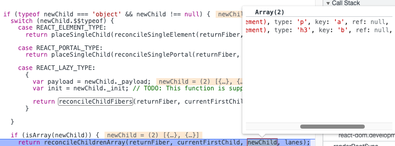

## 前言

在上一节，我们知道了 React 是如何对单节点进行 Diff 的，逻辑很简单，判断 key 和 type 即可，而对于 多节点而言，也就是 Array 而言，在场景上也就是**将一个或多个 Fiber 替换成多个 Fiber**，处理起来会复杂很多<br />这种情况下，`reconcileChildFibers` 的 `newChild` 参数类型为 Array，在 `reconcileChildFibers` 函数内部会进入下面的 if 中，从而处理 array 多节点的 diff

```javascript
  if (isArray(newChild)) {
    // 调用 reconcileChildrenArray 处理
    // ...省略
  }
```

 如下图 newChild 为新的节点，是 Array 类型的

## Diff 的思路

首先我们先看看一共有哪些情况需要被处理：节点更新、节点增加、节点减少、节点位置变化等<br />在实际的场景中，节点更新使用的场景会更加高一些，因此 React 中会**优先处理节点更新**的情况<br />在 `reconcileChildrenArray`的参数中，`currentFirstChild`是 `FiberNode` 也就是链表的结构，`newChild`则是一个 JSX 对象，因此我们**对比的是一个链表和一个数组**

> 虽然本次更新的 JSX 对象 `newChildren` 为数组形式，但是和 `newChildren` 中每个组件进行比较的是 `current fiber`，同级的 Fiber 节点是由 sibling 指针链接形成的单链表，即不支持双指针遍历。
> 即 `newChildren[0]` 与 `fiber` 比较，`newChildren[1]` 与 `fiber.sibling` 比较。
> 所以无法使用**双指针**优化。

因此，基于此原因， Diff 算法采用两轮遍历：<br />第一轮遍历：处理更新的节点<br />第二轮遍历：处理剩下的不属于更新的节点

## 第一轮遍历

第一轮遍历主要处理的是更新的逻辑<br />遍历 `newChildren`，将 `newChildren[i]` 与 `oldFiber`进行比较，判断是否可以复用<br />Diff 的逻辑存在于 `updateSlot` 这个方法中，这个方法的逻辑和 `reconcileSingleElement` 非常像，**如果 key 不同会返回 null**，key 相同会返回新的 Fiber 节点

> 调用 updateSlot 来 diff oldFiber 和 新的child，生成新的fiber

```javascript
function updateSlot( returnFiber: Fiber, oldFiber: Fiber | null,  newChild: any,lanes: Lanes,): Fiber | null {
  const key = oldFiber !== null ? oldFiber.key : null;
// ...
  // 	处理 react Element 
  if (typeof newChild === 'object' && newChild !== null) {
    switch (newChild.$$typeof) {
      case REACT_ELEMENT_TYPE: {
        if (newChild.key === key) {
          return updateElement(returnFiber, oldFiber, newChild, lanes);
        } else {
          return null;
        }
      }
      //...
    }

  return null;
}
```

### 1. key 不同跳出遍历

 当 `updateSlot` 的返回值是 null 时，会跳出第一轮循环<br />这也说明了，`oldFiber` 和 `newIdx` 为下标的 `newChild` **的 key 不同**，说明 `oldFiber` 不能复用

```javascript
if (newFiber === null) {
    if (oldFiber === null) {
      oldFiber = nextOldFiber;
    }
    break;
}
```

### 2. key 相同 type 不同

当 key 相同时，会进入 switch case 中的 if 逻辑，执行 `updateElement` 方法，type 不同而执行 `createFiberFromElement`方法，生成新的 Fiber 

```javascript
function updateElement(
  returnFiber: Fiber,
  current: Fiber | null,
  element: ReactElement,
  lanes: Lanes,
): Fiber {
  const elementType = element.type;
// ...
  if (current !== null) {
    if (current.elementType === elementType ){
    // type 相同逻辑
    }
  }
  // type 不同
  const created = createFiberFromElement(element, returnFiber.mode, lanes);
  created.ref = coerceRef(returnFiber, current, element);
  created.return = returnFiber;
  return created;
}
```

因此此时的 newFiber 为新创建的这个 Fiber 节点，如果是在 `update` 阶段，会进入下面 if 的逻辑，`newFiber` 的 **alternate 指针为 null ，将 oldFiber 标记删除**

```javascript
if (shouldTrackSideEffects) {
  if (oldFiber && newFiber.alternate === null) {
    deleteChild(returnFiber, oldFiber);
  }
}
```

创建了新的 Fiber 节点，我们需要为新的 Fiber 节点赋值一个 placement 的 effectTag ，这样在 commit 阶段才会更新 DOM 插入到 DOM Tree 中

```javascript
function placeChild(
  newFiber: Fiber,
  lastPlacedIndex: number,
  newIndex: number,
): number {
    // 新节点插入的索引
  newFiber.index = newIndex;
  // ...
  const current = newFiber.alternate;
    // 先判断是不是 update
  if (current !== null) {
    const oldIndex = current.index;
    if (oldIndex < lastPlacedIndex) {
      // This is a move.
      newFiber.flags |= Placement;
      return lastPlacedIndex;
    } else {
      // This item can stay in place.
      return oldIndex;
    }
  } else {
    // 新创建的 fiber 节点，alternate 为 null，赋值 placement 的 effectTag
    newFiber.flags |= Placement;
    // lastPlacedIndex 代表本次更新的节点在 DOM 中的位置
    return lastPlacedIndex;
  }
}
```

然后将本次 Diff 生成的新节点与上一个新节点建立连接，也就是 `sibling` 指针指向<br />之后开始对下一个 `oldFiber` 进行 Diff

```javascript
lastPlacedIndex = placeChild(newFiber, lastPlacedIndex, newIdx);
if (previousNewFiber === null) {
  // 标识为 新节点的第一个
  resultingFirstChild = newFiber;
} else {
  // 和前一个新节点连接
  previousNewFiber.sibling = newFiber;
}
previousNewFiber = newFiber;
oldFiber = nextOldFiber;
```

### 3. 遍历完成跳出遍历

#### 1. newChildren 遍历完成，oldFiber 未遍历完成

如果 `newChildren` 遍历完成，而 `oldFiber` 还没遍历完成，那么剩下的所有 `oldFiber` 都需要被删除<br />通过 `deleteRemainingChildren` 函数来对，所有的 `oldFiber` 节点进行删除

```javascript
if (newIdx === newChildren.length) {
  deleteRemainingChildren(returnFiber, oldFiber);
  return resultingFirstChild;
}
```

#### 2. oldFiber 遍历完成，newChildren 未遍历完成

如果是这种情况，需要剩余的 `newChildren` 全都是需要新增的节点，那就继续遍历 `newChildren`的剩余节点，调用 `createChild` 方法来生成新的 Fiber 节点，然后调用 `placeChild` 来打上 `PlaceMent` 的 `effectTag` ，然后建立 sibling 的连接，与 Fiber 树进行关联

```javascript
if (oldFiber === null) {
  // If we don't have any more existing children we can choose a fast path
  // since the rest will all be insertions.
  for (; newIdx < newChildren.length; newIdx++) {
    // 创建 Fiber
    const newFiber = createChild(returnFiber, newChildren[newIdx], lanes);
    if (newFiber === null) {
      continue;
    }
    // 添加 effectTag
    lastPlacedIndex = placeChild(newFiber, lastPlacedIndex, newIdx);
    // 连接 Fiber 树
    if (previousNewFiber === null) {
      // TODO: Move out of the loop. This only happens for the first run.
      resultingFirstChild = newFiber;
    } else {
      previousNewFiber.sibling = newFiber;
    }
    previousNewFiber = newFiber;
  }
   ...
  return resultingFirstChild;
}
```

#### 3. 如果 oldFiber 和 newChildren 都没有遍历完成

这意味着有节点在本次更新中**改变了位置**<br />为了在 **O(1) 复杂度**内，找到 key 对应的 `oldFiber` 节点，通过 `mapRemainingChildren` 函数创建一个以 `oldFiber` 的 key 为键，`oldFiber` 为值的 **Map 数据结构**, 将所有未处理的 `oldFiber` 存入 `key --> FiberNode` 的 Map 中

```javascript
const existingChildren = mapRemainingChildren(returnFiber, oldFiber);
```

## 第二轮遍历

只有在 `oldFiber` 和 `newChildren` 都没有遍历完成的情况下，才会进入第二轮遍历，遍历是基于生成的 Map 数据结构 `existingChildren` 进行的。<br />遍历 `newChildren`，**通过 **`updateFromMap`** 函数从 Map(**`existingChildren`**) 中找到具有相同 key 的 oldFiber**

```javascript
for (; newIdx < newChildren.length; newIdx++) {
  const newFiber = updateFromMap(
    existingChildren,
    returnFiber,
    newIdx,
    newChildren[newIdx],
    lanes,
  );
  if (newFiber !== null) {
    // update 阶段，从 map 中删除 oldFiber
    if (shouldTrackSideEffects) {
      if (newFiber.alternate !== null) {
        existingChildren.delete(
          newFiber.key === null ? newIdx : newFiber.key,
        );
      }
    }
    // 打上 placeMent 的 effectTag
    lastPlacedIndex = placeChild(newFiber, lastPlacedIndex, newIdx);
    // 建立 Fiber 连接
    if (previousNewFiber === null) {
      resultingFirstChild = newFiber;
    } else {
      previousNewFiber.sibling = newFiber;
    }
    previousNewFiber = newFiber;
  }
}
```

- 如果找到了，则基于 `oldFiber` 和 `newChildren` 的 `props` 创建新的 `fiber`，然后从 `Map`中删除该 `oldFiber`，打上 PlaceMent 的 effectTag，并将新生成 Fiber 与 Fiber 树建立连接

需要注意的是，这次的 placeChild 中，我们需要关注它的核心逻辑

- 当 `oldIndex < lastPlacedIndex` 时，表示该可复用节点**之前的位置**索引小于这次更新需要插入的位置索引，代表该节点需要**向右移动**
- 如果 `oldIndex >= lastPlacedIndex` 代表该**可复用节点不需要移动**

```javascript
function placeChild(
...
    const oldIndex = current.index;
    if (oldIndex < lastPlacedIndex) {
      // This is a move.
      newFiber.flags |= Placement;
      return lastPlacedIndex;
    } else {
      // This item can stay in place.
      return oldIndex;
    }
...
}
```

如果在 `newChildren` 遍历完成后，`map` 中还有值，则需要**全部进行删除标记**，因为在 `newChildren` 中已经不存在了

```javascript
if (shouldTrackSideEffects) {
  existingChildren.forEach(child => deleteChild(returnFiber, child));
}
```

至此，`reconcileChildArray` 流程已经全部走完，多节点 Diff 的逻辑已经全部讲解完毕！

---
