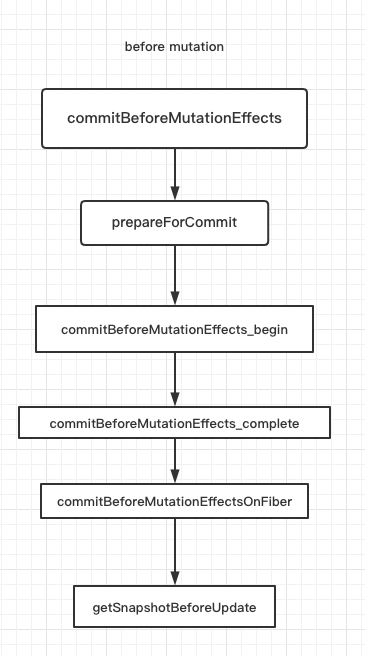

## 概览

首先是 before mutation 阶段，在 before mutation 阶段，会执行 `commitBeforeMutationEffects` 函数，因为此时还没有对真实 DOM 进行修改，因此是**获取 DOM 快照的最佳时期**，同时也会在此异步调用 `useEffect` 

- 执行 `commitBeforeMutationEffectsOnFiber` 函数
  - DOM 组件的 `blur` 和 `focus` 事件相关
  - 对于类组件，执行 `getSnapshotBeforeUpdate` 生命周期函数
- 如果 FC 中使用到的 `useEffect` ，会通过 `scheduleCallback` 来调度 `passiveEffect` 异步执行

> passiveEffect 就是 useEffect 对应的 effectTag

`beforemutation` 阶段的主要控制函数在于 `commitBeforeMutationEffects`，主要做的事情就是初始化全局变量 `nextEffect` 以及 `focusedInstanceHandle`，然后调用 `commitBeforeMutationEffects_begin` 来处理副作用<br />

```javascript
export function commitBeforeMutationEffects(
  root: FiberRoot,
  firstChild: Fiber,
) {
  focusedInstanceHandle = prepareForCommit(root.containerInfo);

  nextEffect = firstChild;
  // NOTE：开始执行，
  commitBeforeMutationEffects_begin();

  // 不再跟踪fiber节点
  const shouldFire = shouldFireAfterActiveInstanceBlur;
  shouldFireAfterActiveInstanceBlur = false;
  focusedInstanceHandle = null;

  return shouldFire;
}
```

## prepareForCommit 

首先会执行 `prepareForCommit` 函数，调用 `getClosestInstanceFromNode` 方法，获取当前节点最近的 `HostComponent` 或 `HostText` 类型对应的 Fiber 节点，来**初始化全局变量** `focusedInstanceHandle`，用来处理 focus 状态

```javascript
export function prepareForCommit(containerInfo: Container): Object | null {
  eventsEnabled = ReactBrowserEventEmitterIsEnabled();
  selectionInformation = getSelectionInformation();
  let activeInstance = null;
  if (enableCreateEventHandleAPI) {
    const focusedElem = selectionInformation.focusedElem;
    if (focusedElem !== null) {
      activeInstance = getClosestInstanceFromNode(focusedElem);
    }
  }
  ReactBrowserEventEmitterSetEnabled(false);
  return activeInstance;
}
```

## commitBeforeMutationEffects_begin

在 `commitBeforeMutationEffects_begin` 函数中会遍历 `effectList` 链表，对每个遍历到的 Fiber 节点调用 `commitBeforeMutationEffects_complete` 函数来**更新 props 和 state**<br />如果当前的 Fiber 节点上的 `deletions` 字段被标记了值，意味着节点即将被删除，会调用 `commitBeforeMutationEffectsDeletion` 来**创建 blur 事件并进行派发**

```javascript
function commitBeforeMutationEffects_begin() {
  while (nextEffect !== null) {
    const fiber = nextEffect;
    // This phase is only used for beforeActiveInstanceBlur.
    // Let's skip the whole loop if it's off.
    if (enableCreateEventHandleAPI) {
      const deletions = fiber.deletions;
      if (deletions !== null) {
        for (let i = 0; i < deletions.length; i++) {
          const deletion = deletions[i];
          // 调用 dispatchBeforeDetachedBlur() 来创建 blur 事件并派发
          commitBeforeMutationEffectsDeletion(deletion);
        }
      }
    }

    const child = fiber.child;
    if (
      (fiber.subtreeFlags & BeforeMutationMask) !== NoFlags &&
      child !== null
    ) {
      ensureCorrectReturnPointer(child, fiber);
      nextEffect = child;
    } else {
      // 更新fiber节点的 props 和 state
      commitBeforeMutationEffects_complete();
    }
  }
}
```

## commitBeforeMutationEffectsOnFiber

在 `commitBeforeMutationEffects_begin` 中会调用 `commitBeforeMutationEffects_complete` 函数，在 `commitBeforeMutationEffects_complete` 中同样会遍历 `effectList` 链表，执行 `commitBeforeMutationEffectsOnFiber`函数，这也是 `before_mutation`的**核心逻辑**

- **首先会处理 blur 和 focus 相关逻辑**
- **其次会执行 getSnapshotBeforeUpdate 的生命周期函数**

会根据 Fiber 节点 tag 的不同进入不同的处理逻辑，同时会根据 `current` 是否存在来**判断是 mount 还是 update 阶段**，进入不同的处理逻辑

对于 CC 而言，最重要的就是**触发生命周期函数，获取当前 DOM 的数据信息**

```javascript
function commitBeforeMutationEffectsOnFiber(finishedWork: Fiber) {
    const current = finishedWork.alternate;
    const flags = finishedWork.flags;
     ...
    if ((flags & Snapshot) !== NoFlags) {
         ...
        switch (finishedWork.tag) {
            case FunctionComponent:
            case ForwardRef:
            case SimpleMemoComponent: {
                break;
            }
            case ClassComponent: {
                if (current !== null) {
                    // 非首次渲染的情况
                    // 获取上一次的props
                    const prevProps = current.memoizedProps;
                    // 获取上一次的 state
                    const prevState = current.memoizedState;
                    // 获取当前 class组件实例
                    const instance = finishedWork.stateNode;
                    // 更新 props 和 state
                    ...
                    // 调用 getSnapshotBeforeUpdate 生命周期方法
                    const snapshot = instance.getSnapshotBeforeUpdate(
                        finishedWork.elementType === finishedWork.type
                            ? prevProps
                            : resolveDefaultProps(finishedWork.type, prevProps),
                        prevState,
                    );
                     ...
                    // 将生成的 snapshot 保存到 instance.__reactInternalSnapshotBeforeUpdate 上
                    // 供 DidUpdate 生命周期使用
                    instance.__reactInternalSnapshotBeforeUpdate = snapshot;
                }
                break;
            }
             ...
        }
      ...
    }
}
```

从 React 16 版本开始，`componentWillXX` 生命周期函数加上了 `UNSAFE_ ` 的前缀，这是因为 `Reconciler` 重构为 **`Fiber Reconciler`** 后，`render` 阶段执行的任务可能会因为某些特殊原因（有优先级更高任务）会被**中断或者是重新开始**，对应的组件在 `render` 阶段的生命周期钩子(即 `componentWillXX` )可能会有**触发多次**的情况，因此加上了 `UNSAFE_ ` 前缀，减少使用
<br />而新增的 **`getSnapShotBeforeUpdate` 生命周期函数**，它是在 `commit` 阶段内的 `before mutation` 阶段调用的，由于 `commit` 阶段是**同步执行的**，所以不会遇到多次调用的情况。

## 调度 useEffect
> 这一部分在 `commitBeforeMutationEffects` 函数执行之前，也属于 before mutation 阶段

对于 `useEffect` ,会通过 `scheduler` 模块提供的 `scheduleCallback` 进行调度，用来**以某个优先级异步调度一个回调函数。**

```javascript
// 调度 useEffect
if (
  (finishedWork.subtreeFlags & PassiveMask) !== NoFlags ||
  (finishedWork.flags & PassiveMask) !== NoFlags
) {
  if (!rootDoesHavePassiveEffects) {
    rootDoesHavePassiveEffects = true;
    pendingPassiveEffectsRemainingLanes = remainingLanes;
    scheduleCallback(NormalSchedulerPriority, () => {
      // 触发 useEffect
      flushPassiveEffects();
      return null;
    });
  }
}
```

在此处，被异步调度的回调函数就是触发 `useEffect` 的方法 `flushPassiveEffects`，这个回调函数会在调度后执行，**相当于在这里注册了这个回调函数。**<br />所以整个 `useEffect` 异步调用分为三步：

1. before mutation 阶段在 `scheduleCallback` 中调度 `flushPassiveEffects`
2. `layout` 阶段之后将 `effectList` 赋值给 `rootWithPendingPassiveEffects`
3. `scheduleCallback` 触发 `flushPassiveEffects`，`flushPassiveEffects`内部遍历`rootWithPendingPassiveEffects`

**在 React 官方文档中，也对 useEffect 的执行时机做出了解释**

> 与 `componentDidMount`、`componentDidUpdate` 不同的是，传给 `useEffect` 的函数会**在浏览器完成布局与绘制之后**，在一个延迟事件中被调用。这使得它适用于许多常见的副作用场景，比如设置订阅和事件处理等情况，因为绝大多数操作不应阻塞浏览器对屏幕的更新。

此外，从 React 18 开始，当它是离散的用户输入（如点击）的结果时，或者当它是由 [flushSync](https://zh-hans.reactjs.org/docs/react-dom.html#flushsync) 包装的更新结果时，传递给 `useEffect` 的函数将在**屏幕布局和绘制之前同步执行**。这种行为便于事件系统或 [flushSync](https://zh-hans.reactjs.org/docs/react-dom.html#flushsync) 的调用者观察该效果的结果。**少用！！少用！！会影响性能**

---

接下来我们来看看 mutation 阶段的工作