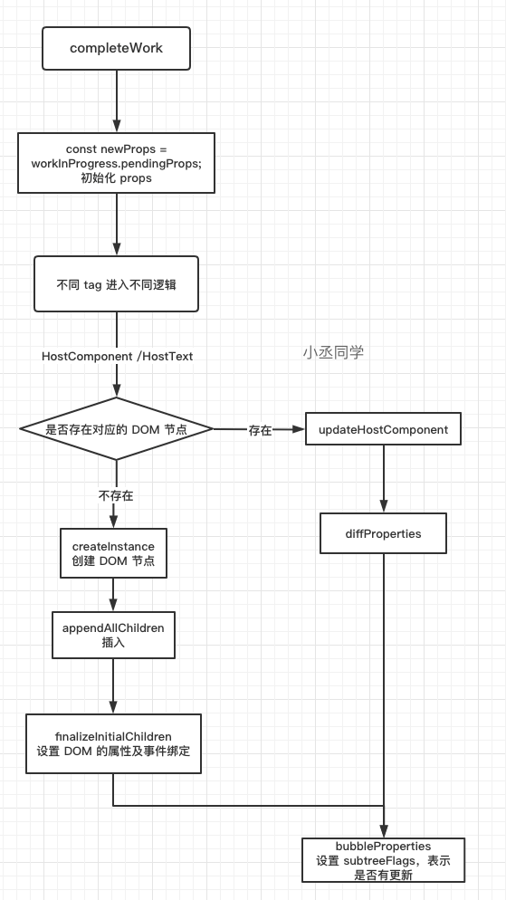

在上一节，我们已经讲过了 beginwork 阶段的工作流程，这一节来讲与 beginwork 相对的 completeWork 的工作流程<br />作为  render 的“归”阶段，需在 render 的“递”阶段结束后才会执行；换句话说，当 beginWork 返回 null 值，即**当前节点无（或无需关注）当前节点的子Fiber节点**时，才会进入到 render 的 completeWork 阶段

## 概述

render 阶段就是通过深度优先遍历的方式，来执行 Fiber 节点的 `beginWork` 和 `completeWork`。在 `beginWork`完成后会创建**子 Fiber 节点**，节点上可能会存在 `effectTag`(即 `flags`)，同时在 Diff 阶段之后，`workInProgress` 节点就会进入 `completework` 阶段。这个时候拿到的 `workInProgress` 节点都是已经被调和过的，也就意味着对于某个节点来说它的 **Fiber 的形态已经基本确定了**

> 只有当 beginWork 返回 null ，即当前节点无子 Fiber 节点时，才会进入 render 的 completeWork 阶段

在开始 `completeWork` 之前，需要先明确几点

- 在 `beginWork`阶段的 `reconcileChildren` 阶段中，会为 `workInProgress` 节点标记 `effectTag`
- 对于 `HostComponent` 和 `HostText` 来说，Fiber 形态的改变，并不会影响 DOM 节点的变化

**因此，completeWork 的工作可以划分为以下几点**

- 构建或更新 DOM 节点
- 自下而上收集 `effectTag`，形成 `effectList` 链表，最终收集到 `rootFiber` 上

对于 `workInProgress` 节点**更新出错**的时候，会对出错的节点采取措施，会有额外的错误处理过程

## 流程概览

和 `beginWork`类似，**归阶段**的入口在 `completeUnitOfWork`，在这个函数内部有一个循环，会从下到上的遍历 `workInProgress` 节点，依次处理<br />对于**正常**的 `workInProgress` 节点，会执行 `completeWork`，这其中会对 Host Component 类型的节点完成**更新 props、事件绑定等 DOM 操作**<br />异常节点会进入 `unwindWork`进行处理

> Host Component 就是 DOM 组件对应的 Fiber 节点

```javascript
function completeUnitOfWork(unitOfWork: Fiber): void {
  let completedWork = unitOfWork;
  do {
    const current = completedWork.alternate;
    const returnFiber = completedWork.return;
    if ((completedWork.flags & Incomplete) === NoFlags) {
      // 如果 workInProgress 节点没有出错的逻辑
      setCurrentDebugFiberInDEV(completedWork);
      let next;
      // 对节点进行completeWork，生成DOM，更新props，绑定事件
      // 省略判断的逻辑，最终都是执行 completeWork
      next = completeWork(current, completedWork, subtreeRenderLanes);

      if (next !== null) {
        // 任务被挂起
        workInProgress = next;
        return;
      }
    } else {
      // unwindWork 处理更新错误的逻辑
      const next = unwindWork(completedWork, subtreeRenderLanes);	
      ...
    }
    // 查找有没有兄弟节点，如果有则进行 beginWork -- completeWork
    const siblingFiber = completedWork.sibling;
    if (siblingFiber !== null) {
      workInProgress = siblingFiber;
      return;
    }
    // 若没有兄弟节点，那么向上回到父级节点进行 completeWork
    completedWork = returnFiber;
    workInProgress = completedWork;
  } while (completedWork !== null);

  // 到了 rootFiber 节点，标记整棵树完成
  if (workInProgressRootExitStatus === RootIncomplete) {
    workInProgressRootExitStatus = RootCompleted;
  }
}
```

`completeUnitOfWork`的主要逻辑在于对整个 “归”阶段进行控制

1. 调用 `completeWork` 方法来完成对当前 `Fiber` 节点对应的 DOM 节点的创建等操作
1. 设置 subtreeFlags 标识子树是否有更新（替代了原先的 effect List 副作用链表）
1. 若当前 Fiber 节点有 sibling 节点，则进入该节点的 performUnitOfWork 开始一轮子树的 beginWork
1. 如果没有 sibling 节点，则会开始父节点的 completeWork
1. 直到 rootFiber 节点，completeWork 工作完成

## completeWork 主要工作

对于 React 来说，大部分的节点最终都是 DOM 节点，因此对于 HostComponent 的处理至关重要，在 `completeWork` 中会对不同的 tag 做不同的处理，对于 Host Component 和 HostText 的处理都是为其创建对应的 DOM 节点，处理方法都会分为**更新和创建**，如果 current 存在并且 `workInProgress.stateNode` 存在，说明对应的 DOM 节点已经存在，会进入更新的逻辑，

```javascript
function completeWork(
  current: Fiber | null,
  workInProgress: Fiber,
  renderLanes: Lanes,
): Fiber | null {

  ...

  switch (workInProgress.tag) {
    case IndeterminateComponent:
    case LazyComponent:
    case SimpleMemoComponent:
    case FunctionComponent:
    case ForwardRef:
    case Fragment:
    case Mode:
    case Profiler:
    case ContextConsumer:
    case MemoComponent:
      return null;
    case ClassComponent: {
      // ...省略
      return null;
    }
    case HostComponent: {
      ...
      if (current !== null && workInProgress.stateNode != null) {
        // 更新
      } else {
        // 创建
      }
      return null;
    }
    case HostText: {
      const newText = newProps;
      if (current && workInProgress.stateNode != null) {
        // 更新
      } else {
        // 创建
      }
      return null;
    }
    case SuspenseComponent:
    ...
  }
}

```

完整流程图<br />

### 处理 Host Component

`completeWork` 处理的是 **Diff 算法之后产生的新 Fiber**，因此对于 `completeWork` 来说，接受到的 `workInProgress` 可能是需要创建，也有可能是更新。因此需要判断出是执行更新 DOM 的过程，还是创建 DOM 的过程。<br />对于需要执行创建操作的节点来说，还需要进行额外的插入操作，与整棵 DOM 树进行连接

```javascript
case HostComponent: {
  popHostContext(workInProgress);
  const rootContainerInstance = getRootHostContainer();
  const type = workInProgress.type;
  if (current !== null && workInProgress.stateNode != null) {
    // 已有节点，进入更新 DOM 的逻辑
    updateHostComponent(
      current,
      workInProgress,
      type,
      newProps,
      rootContainerInstance,
    );

    if (current.ref !== workInProgress.ref) {
      markRef(workInProgress);
    }
  } else {
    // 如果没有新的props并且stateNode为null, 可能是React发生了内部错误
    ...

    const currentHostContext = getHostContext();
    const wasHydrated = popHydrationState(workInProgress);
    if (wasHydrated) {
      // SSR 相关
    } else {
      // fiber 不存在对应的 DOM 节点，进行创建
      const instance = createInstance(
        type,
        newProps,
        rootContainerInstance,
        currentHostContext,
        workInProgress,
      );
      // 插入
      appendAllChildren(instance, workInProgress, false, false);
      // 挂载到 Fiber 上
      workInProgress.stateNode = instance;

      if (
        // 设置 DOM 对象的属性和事件绑定
        finalizeInitialChildren(
          instance,
          type,
          newProps,
          rootContainerInstance,
          currentHostContext,
        )
      ) {
         // 设置fiber.flags标记(Update)
        markUpdate(workInProgress);
      }
    }

    if (workInProgress.ref !== null) {
      // 设置fiber.flags标记(Ref)
      markRef(workInProgress);
    }
  }
  // 副作用相关
  bubbleProperties(workInProgress);
  return null;
}
```

### mount 时

mount 时的主要逻辑包括三个

- 为 Fiber 节点生成对应的 DOM 节点
- 将子孙节点插入当前生成的 DOM 节点中（因为自下而上）
- 处理 props 以及事件绑定

#### createInstance

通过调用 `createInstance` 创建新的 DOM 节点

```javascript
export function createInstance(
  type: string,
  props: Props,
  rootContainerInstance: Container,
  hostContext: HostContext,
  internalInstanceHandle: Object,
): Instance {
  let parentNamespace: string;
  ...
  // 确定该DOM节点的命名空间
  parentNamespace = ((hostContext: any): HostContextProd); 
  // 创建 DOM 元素
  const domElement: Instance = createElement(
    type,
    props,
    rootContainerInstance,
    parentNamespace,
  );
  // 缓存 Fiber 节点
  precacheFiberNode(internalInstanceHandle, domElement);
  //更新 fiber 节点的 props, 在 DOM 实例上
  updateFiberProps(domElement, props);
  return domElement;
}
```

#### appendAllChildren

在创建好了新的 DOM 节点后，会执行 `appendAllChildren` 将**所有子节点插入到刚刚创建好的 DOM 节点上**，在全部插入完毕后会执行 `workInProgress.stateNode = instance;` 将 DOM 节点挂载到 Fiber 节点的 `stateNode` 属性上

> 需要注意的是 completeWork 是自下而上执行的，这里的 DOM 节点插入，是将已经创建好的 子 DOM 节点，插入到当前刚创建的 DOM 节点上，建立起连接

同时对于整体而言，DOM 节点的插入是深度优先遍历进行的，整个的 DOM 节点插入的过程并没有将真实的 DOM 节点插入到真实的页面上，只是在内存中操作，最后挂载到了 `stateNode` 上。真实的 DOM 操作发生在 `commit` 阶段进行

```javascript
appendAllChildren = function (parent, workInProgress, needsVisibilityToggle, isHidden) {
    // 拿到当前工作单元的child Fiber节点
    var node = workInProgress.child;

    while (node !== null) {
        if (node.tag === HostComponent || node.tag === HostText) { 
            // 调用 parent.appendChild(node.stateNode);
            appendInitialChild(parent, node.stateNode);
        }
      ...

        if (node === workInProgress) { // 如果是当前工作单元, 插入完毕
            return;
        }

        while (node.sibling === null) { // 没有兄弟节点则Fiber向上冒泡
            if (node.return === null || node.return === workInProgress) {
                return;
            }
            node = node.return;
        }

        node.sibling.return = node.return; // 把兄弟节点的return节点赋值给父节点
        node = node.sibling; // 把node赋值为兄弟节点
    }
};
```

在首屏渲染时，会将所有的子孙 DOM 节点插入到新生成的 DOM 节点下，当 completeWork 执行到 rootFiber 时，我没以及在内存中构建好了一颗 DOM 树，这样只需要一个 Placement 的 effectTag，就可以完成首屏渲染

#### finalizeInitialChildren

然后执行的是 `finalizeInitialChildren` 方法<br />从下面的代码段，我们可以很清晰地看到 `finalizeInitialChildren` 主要分为两个步骤：

1. 执行 `setInitialProperties` 方法

> 注意：该方法是会真正将 DOM 属性挂载到 DOM 节点上的，也会真正地调用 [addEventListener](https://link.juejin.cn?target=https%3A%2F%2Fgithub.com%2Ffacebook%2Freact%2Fblob%2F1fb18e22ae%2Fpackages%2Freact-dom%2Fsrc%2Fevents%2FEventListener.js) 把事件处理回调绑定在当前 DOM 节点上的。

2. 执行 `shouldAutoFocusHostComponent` 方法：返回 `props.autoFocus` 的值（仅 button / input / select / textarea 支持）。

```javascript
export function finalizeInitialChildren(
  domElement: Instance,
  type: string,
  props: Props,
  rootContainerInstance: Container,
  hostContext: HostContext,
): boolean {
  setInitialProperties(domElement, type, props, rootContainerInstance);
  return shouldAutoFocusHostComponent(type, props);
}
```

 `setInitialProperties`方法，来**判断 props 是否合法**，并对 DOM 节点进行一些操作，并把初始化的属性赋值到当前的 DOM 上，同时也会把**事件处理回调**绑定在当前的 DOM 节点上

```javascript
function setInitialProperties(domElement, tag, rawProps, rootContainerElement) {
  var isCustomComponentTag = isCustomComponent(tag, rawProps);

  {
    validatePropertiesInDevelopment(tag, rawProps);
  } 

  var props;

  switch (tag) {
     ...
    // 跳过一些dom节点的判断逻辑
    default:
      props = rawProps;
  }

  // 判断 props 是否合法
  assertValidProps(tag, props);

  // 设置初始化的dom属性
  setInitialDOMProperties(tag, domElement, rootContainerElement, props, isCustomComponentTag);

  switch (tag) {
    case 'input':
      track(domElement);
      postMountWrapper(domElement, rawProps, false);
      break;
      ...
      break;
  }
}
```

在 `setInitialDOMProperties` 函数中会调用新的 props ，并对每个 propKey 做特定的赋值操作，并会调用 `setValueForProperty` 来为创建好的 DOM 元素设置属性（`node.setAttribute`) 

#### 处理 ref

判断 ref 是否存在，如果存在 ref 调用 `markRef`，会为当前的 fiber 上的 flags 设置对应的标识

```javascript
function markRef(workInProgress: Fiber) {
  workInProgress.flags |= Ref;
  if (enableSuspenseLayoutEffectSemantics) {
    workInProgress.flags |= RefStatic;
  }
}
```

#### bubbleProperties

最后执行 `bubbleProperties`，根据 `fiber.child` 和 `fiber.child.sibling` **更新`subtreeFlags` 和`childLanes`**，主要是为了标记子树有没有更新，这样就可以通过 `fiber.subtreeFlags` 来快速判断子树中是否有副作用，不需要深度优先遍历去搜索

```javascript
let child = completedWork.child;
while (child !== null) {
  newChildLanes = mergeLanes(
    newChildLanes,
    mergeLanes(child.lanes, child.childLanes),
  );

  subtreeFlags |= child.subtreeFlags & StaticMask;
  subtreeFlags |= child.flags & StaticMask;

  child.return = completedWork;

  child = child.sibling;
}
}

completedWork.subtreeFlags |= subtreeFlags;
```

**subtreeFlags 是 fiber 结构中的一个属性，代表子树中包含的副作用，避免深度遍历**

> 在 React 17 版本中，用 subTreeFlags 来替代了原先 finishWork.firstEffect 的副作用链表

### update 时

在 update 时，Fiber 节点已经存在了对应的 DOM 节点，**因此不需要创建 DOM 节点，只需要对属性进行更新即可**，因为节点已经存在，不存在删除和新增的情况<br />主要会处理 props，包括 style、children、onClick 等，并会将处理好的 props 赋值给 `updatePayload`，最后保存到 `updateQueue` 上<br />在 `completeWork` 中，更新会进入 if 的逻辑，执行 `updateHostComponent`对 DOM 节点的属性进行更新

```javascript
if (current !== null && workInProgress.stateNode != null) {
    // 已有节点，进入更新 DOM 的逻辑
    updateHostComponent(
      current,
      workInProgress,
      type,
      newProps,
      rootContainerInstance,
    );

    if (current.ref !== workInProgress.ref) {
      markRef(workInProgress);
    }
  } 
...
}
```

#### updateHostComponent

在 `updateHostComponent` 函数中会将最终需要 update 的 props 挂载到 update Queue 中，在 commit 阶段进行更新，在这里最重要的就是通过执行 `prepareUpdate` 去计算需要更新的新属性

```javascript
updateHostComponent = function (
  current: Fiber,
  workInProgress: Fiber,
  type: Type,
  newProps: Props,
  rootContainerInstance: Container,
) {
  const oldProps = current.memoizedProps; // 获取 props
  // props 相同，进入了 bailout 阶段，跳过
  if (oldProps === newProps) {
    return;
  }

  const instance: Instance = workInProgress.stateNode; // 获取 DOM 实例
  const currentHostContext = getHostContext();
  
  const updatePayload = prepareUpdate(
    instance,
    type,
    oldProps,
    newProps,
    rootContainerInstance,
    currentHostContext,
  );
  // 最终新属性被挂载到 updateQueue 上， commit 阶段使用
  workInProgress.updateQueue = (updatePayload: any);

  if (updatePayload) {
    //标记更新 flags |= Update
    markUpdate(workInProgress);
  }
};
```

#### prepareUpdate

`prepareUpdate`函数会直接调用 `diffProperties`来 diff 出 props 的不同

```javascript
export function prepareUpdate(
  domElement: Instance,
  type: string,
  oldProps: Props,
  newProps: Props,
  rootContainerInstance: Container,
  hostContext: HostContext,
): null | Array<mixed> {
  ...
  return diffProperties(
    domElement,
    type,
    oldProps,
    newProps,
    rootContainerInstance,
  );
}
```

#### diffProperties

`diffProperties`会返回一个 updatePayload 数组，第 i 项是对应的 `propKey`，第 i + 1 项是对应的 `value`

```javascript
updatePayload = ["props", null, "style", {"color":"pink"} ]
```

当存在 updatePayload 时，意味着这个 HostComponent 存在着更新，会调用 markUpdate 设置 flags（effectTag）进行标识，在 commit 阶段进行更新<br />执行完这个`diffProperties`, 再执行`bubbleProperties`, 然后就结束了当前节点的 `completeWork` 阶段

## 流程结束

至此，render 阶段的工作全部完成了，在 performSyncWorkOnRoot 函数中 fiberRoot 被传递给 commitRoot，开启了 commit 阶段的工作

```javascript
commitRoot(root);
```

## 总结

- `completeUnitOfWork` 方法主要工作是循环执行 `completeWork`，父元素为空或存在 sibling 节点，会先生成 sibling 对应的 Fiber 节点
- `completeWork` 的主要工作是根据 Fiber 节点生成对应的 DOM 节点，并连接起子节点
- 在更新时会对 DOM 节点对应的新旧 props 进行 diff，并打上 `updatePayload`
- 最终结束 `completeUnitOfWork` 执行，进入 `commit` 阶段

