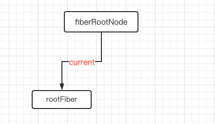

在 React 16 版本中采用了**新的 Reconciler** 来实现 异步可中断的更新， Reconciler 内部采用了全新的 Fiber 架构来实现。这节来谈谈 Fiber 架构
## Fiber 架构的起源
在 React15 及以前，Reconciler 采用**递归**的方式创建虚拟 DOM，递归过程是**不能中断**的。如果组件树的**层级很深**，递归会占用线程很多时间，造成卡顿，因为浏览器所有的时间都交给了 js 执行，并且 js 的执行时单线程的，导致无法在一帧内执行完毕。同时 React 15 采用了调用堆栈的方式，造成了调用栈过深难以执行等问题<br /><br />为了解决这些问题，React 16 就引入了**Scheduler调度器**进行时间片的调度，给每个 task 工作单元分配一定的时间，如果在这个时间内任务没有执行完，也要交出执行权给浏览器进行回流和重绘，因此实现异步可中断的更新需要一定的数据结构在内存中保存工作单元的信息，曾经的虚拟 DOM 数据结构已经无法满足需要，于是有了新的数据结构，也就是 Fiber <br />**React Fiber 的目标是提高它在动画、布局和手势等领域的适用性。最重要的功能就是增量渲染：能够将渲染工作分成块，并将其分散到多个帧上**<br />其他关键功能有以下

- 在新更新到来时**暂停、中止或重用工作的能力**
- 能够为不同类型的更新分配优先级
- 新的并发原语

**React Fiber 是调用堆栈的重新实现，专门用于 React 组件，也就是一种 虚拟堆栈帧，这样的优点是将堆栈帧保存在内存中，并随行所欲的执行他们。**<br />
## 认识 Fiber
首先需要弄清楚 React.element 、Fiber 和 真实 DOM 节点三者间的关系<br />

- element 是 React 视图层在代码的表象，也就是我们写的 JSX ，这些都会被创建成 element 对象的形式，上面保存了 props、children 等信息
- DOM 就很纯粹了就是浏览器真实渲染的
- Fiber 可以说是 elmenet 和真实 DOM 的桥梁，每一个类型的 element 都会有一个对应类型的 Fiber，element 变化引起更新流程都是通过 Fiber 做一次调和改变，然后通知渲染器形成新的 DOM 渲染

在 Fiber 结构中 element 和 Fiber 之间的对应关系
```javascript
export const FunctionComponent = 0;       // 对应函数组件
export const ClassComponent = 1;          // 对应的类组件
export const IndeterminateComponent = 2;  // 初始化时不知道是函数组件还是类组件 
export const HostRoot = 3;                // Root Fiber 可以理解为跟元素
export const HostPortal = 4;              // 对应  ReactDOM.createPortal 产生的 Portal 
export const HostComponent = 5;           // dom 元素 比如 <div>
export const HostText = 6;                // 文本节点
export const Fragment = 7;                // 对应 <React.Fragment> 
export const Mode = 8;                    // 对应 <React.StrictMode>   
export const ContextConsumer = 9;         // 对应 <Context.Consumer>
export const ContextProvider = 10;        // 对应 <Context.Provider>
export const ForwardRef = 11;             // 对应 React.ForwardRef
export const Profiler = 12;               // 对应 <Profiler/ >
export const SuspenseComponent = 13;      // 对应 <Suspense>
export const MemoComponent = 14;          // 对应 React.memo 返回的组件
```
## Fiber 的作用
那么有了 Fiber 这种数据结构后，能完成哪些事情呢，

- **工作单元 任务分解** ：Fiber 最重要的功能就是**作为工作单元**，保存原生节点或者组件节点对应信息（包括优先级），这些节点通过**链表**的形似形成 Fiber 树
- **增量渲染**：通过 jsx 对象和 `current Fiber` 的对比，生成最小的差异补丁，应用到真实节点上
- **根据优先级暂停、继续、排列优先级**：Fiber 节点上保存了**优先级**，能通过不同节点优先级的对比，达到任务的暂停、继续、排列优先级等能力，也为上层实现批量更新、Suspense 提供了基础
- **保存状态**：因为 Fiber 能保存状态和更新的信息，所以就能**实现函数组件的状态更新**，也就是 hooks

## Fiber 的含义

1. 作为架构来说，React15 的 Reconciler 采用递归的方式进行，**数据保存在调用堆栈中**，因此也叫做 `stack Reconciler`，React16 的 Reconciler 基于 Fiber 节点实现，被称为 `Fiber Reconciler`
1. 作为静态数据结构来说，每个 Fiber 节点对应一个 React Element，保存该组件的相关信息
1. 作为动态的工作单元，每个 Fiber 节点保存了本次更新中该组件改变的状态，要执行的工作（effectList）
## Fiber 的结构
Fiber 是一个 JS 对象，Fiber 的创建是根据 React 元素来创建的，在整个 React 构建的虚拟 DOM 树中，每一个元素都有对应的 Fiber，从而构建一个 Fiber 树，每个 Fiber 不仅仅包含每个元素的信息，还包含更多的信息，以方便 Scheduler 来进行调度<br />我们分成几个部分来看
### 静态数据结构的属性
**作为一种静态的数据结构，保存了组件相关的信息：**
```javascript
type Fiber = {|
  // 作为静态数据结构的属性
  // 标记不同的组件类型
  tag: WorkTag,
  // ReactElement 里面的key
  // 唯一标识，如果出现列表的时候，需要为每一个 item 指定 key
  key: null | string,
  // ReactElement.type，createElement 的第一个参数
  elementType: any,
  // 异步组件resolved之后返回的内容，一般是 function 或者 class
  type: any,
  // 当前组件实例的引用,比如浏览器环境就是DOM节点
  stateNode: any,
  ...
|}
```
### 用来形成 Fiber 树的属性
作为架构来说，这些属性用来形成 Fiber Tree
```javascript
type Fiber = {|
  // 指向他在 Fiber 节点树中的 parent，用来在处理完这个节点之后向上返回
  return: Fiber | null,
  // 指向自己的第一个子节点
  child: Fiber | null,
  // 指向自己的兄弟结构
  sibling: Fiber | null,
  index: number,
  ...
|}
```
我们知道了 `Fiber` 可以保存真实的 DOM ，真实的 DOM 对应在内存中的 Fiber 节点会形成 Fiber 树<br />Fiber 树通过 return、child、slibing 指针形成，连接父子兄弟节点以构成一颗单链表 fiber 树，其扁平化的单链表结构的特点将以往递归遍历改为了**循环遍历**，实现深度优先遍历。<br /><br />同时，这颗由真实DOM 构建成的 Fiber 树也就是 `current Fiber Tree`，而正在构建的 Fiber 树叫做 `WIP Fiber`，这两颗树的节点通过 `alternate` 指针相连，这也是 Fiber 架构的双缓存机制，下面会讲到<br />
### 作为动态的工作单元的属性
**作为动态的工作单元，Fiber中如下参数保存了本次更新相关的信息，**
```javascript
type Fiber = {|
  // 新的变动带来的新的props
  pendingProps: any, 
  // 上一次渲染完成之后的props
  memoizedProps: any,

  // 该 Fiber 对应的组件产生的 Update 会存放在这个队列里面
  updateQueue: UpdateQueue<any> | null,

  // 上一次渲染的时候的 state
  // 用来存放某个组件内所有的 Hook 状态
  memoizedState: any,

  // 一个列表，存放这个 Fiber 依赖的 context
  firstContextDependency: ContextDependency<mixed> | null,

  //用来描述fiber是处于何种模式。用二进制位来表示
  mode: TypeOfMode,

  flags: Flags,// fiber 节点包含的副作用标识
  subtreeFlags: Flags,// 子树包含的副作用标识，避免深度遍历
  deletions: Array<Fiber> | null,// 删除的节点，用于执行 unmount 钩子

  // 用来记录Side Effect具体的执行的工作的类型：比如Placement，Update等等
  effectTag: SideEffectTag,

  // 单链表用来快速查找下一个 side effect
  nextEffect: Fiber | null,

  // 子树中第一个side effect
  firstEffect: Fiber | null,
  // 子树中最后一个side effect
  lastEffect: Fiber | null,

  ...
|}
```
### 优先级相关的属性
保存调度的优先级相关的信息
```javascript
type Fiber = {|
  // 调度优先级相关
  this.lanes = NoLanes;
  this.childLanes = NoLanes;
  ...
|}
```
React 原先采用的是 `expiration`的概念，在后来被 `lane` 模型取代了
### 其他
```javascript
// ref指向，ref函数，或者ref对象。
this.ref = null;
//current和workInProgress的指针
this.alternate = null;
```
## Fiber 的更新机制
我们以及知道了 Fiber 有哪些属性，以及 Fiber 之间是如何建立关联的，那么接下来就要看看 Fiber 是如何工作的
### 双缓存机制
当我们使用 `canvas` 绘制动画时，如果上一帧计算量比较大，导致清除上一帧画面到绘制当前帧画面之间有较长间隙，就会出现白屏。<br />为了解决这个问题，`canvas` **在内存中绘制当前动画，绘制完毕后直接用当前帧替换上一帧画面**，由于省去了两帧替换间的计算时间，不会出现从白屏到出现画面的闪烁情况。<br />这种**在内存中构建并直接替换**的技术叫做**双缓存**。
### 双缓存 Fiber 树
React 也践行了这一理念，在 React 中最多会同时存在两颗 Fiber 树。当前真正显示的一颗 Fiber 树，也叫做 current Fiber Tree，正在内存中构建的 Fiber 树称为 workInProgress Fiber 树<br />current Fiber 和 workInProgress Fiber 通过 alternate 指针相互连接
```javascript
currentFiber.alternate === workInProgressFiber;
workInProgressFiber.alternate === currentFiber;
```
在下一次渲染时，React 会直接复用 workInProgress Fiber 树作为下一次的渲染树，上一次的渲染树又作为缓存树，这样不仅防止只有一棵树容易状态丢失的问题，又加快了 DOM 节点的更新和替换
### mount 时
#### 第一步：创建 FiberRoot 和 RootFiber
首次执行 `ReactDOM.render` 会创建 `fiberRoot` 和 `rootFiber`，**其中 **`**fiberRoot**`** 是整个应用的根节点，**`**rootFiber**`** 是组件树的根节点，**一个 React 应用可以有多个 `rootFiber`，但是只能有一个 `fiberRoot`
```javascript
render(<Index/>, document.getElementById('app'));
```
第一次挂载时，会将 `fiberRoot` 和 `rootFiber` 建立起关联，也就是 current 指针
```javascript
function createFiberRoot(containerInfo,tag){
    /* 创建一个root */
    const root = new FiberRootNode(containerInfo,tag)
    const rootFiber = createHostRootFiber(tag);
    root.current = rootFiber
    return root
}
```
<br />因为是首屏渲染，页面中还没有挂载任何的 DOM，所以 `fiberRoot.current` 指向的 rootFiber 没有任何的 子 Fiber 节点
#### 第二步：workInProgress 和 current
接下来进入了 `render` 阶段，会进入 `beginWork` 的流程，会根据组件返回的 JSX 在内存中依次创建 Fiber 节点，并连接在一起构建形成 Fiber 树，被称为 `workInProgress Fiber` 树
> - workInProgress：正在内存中构建的 Fiber 树称为 `workInProgress Fiber`树。在一次更新中，所有的更新都是发生在 workInProgress 树上。在一次更新之后，workInProgress 树上的状态是最新的状态，那么它将变成 current 树用于渲染视图。
> - current：正在视图层渲染的树叫做 current 树。

在构建 WIP Fiber 树的时候会尝试复用 current Fiber 树，中已有的 Fiber 节点内的属性，也就是 alternate。在首屏渲染中初始化的 rootFiber 是没有 alternate 的，那么会创建一个 Fiber 作为 WIP，会用 alternate 指针将 WIP 和 current 树建立关联
```javascript
currentFiber.alternate = workInProgressFiber
workInProgressFiber.alternate = currentFiber
```
#### <br />第三步：深度调和子节点，渲染视图
接下来会按照上一步的方法，在 WIP 下完成整个 Fiber 的遍历及创建，生成一颗完整的 WIP Tree<br />最后会以 workInProgress 作为最新的渲染树，**fiberRoot 的 current 指针指向 workInProgress 使其变为 current Fiber 树。到此完成初始化流程。**<br />
### update 时
接着上面的结构，当我们点击一次按钮触发更新时，首先会创建一颗 `workInProgress` 树，复用当前 `current` 树上的 `alternate` ，作为新的 WIP，由于初始化 `rootFiber` 有 `alternate` ，所以对于剩余的子节点，React 还需要创建一份，和 `current` 树上的 `Fiber` 建立起 `alternate`关联。渲染完毕后，`workInProgress` 再次变成 `current` 树<br />
### 整体更新流程

1. 初始化渲染，根据 React Element 生成对应的 Fiber 树 
1. 进行 setState 等操作，触发更新 
1. 创建 workInProgress 副本，进入 Reconciliation 执行对应的 render 更新。 
1. 记录有副作用的 fiber 节点，放入一个队列 
1. 完成 Reconciliation，进入 Commit 阶段，取出有副作用的 fiber 节点，通过 fiber 节点的 nextEffect 属性访问有副作用的节点，进行更新
