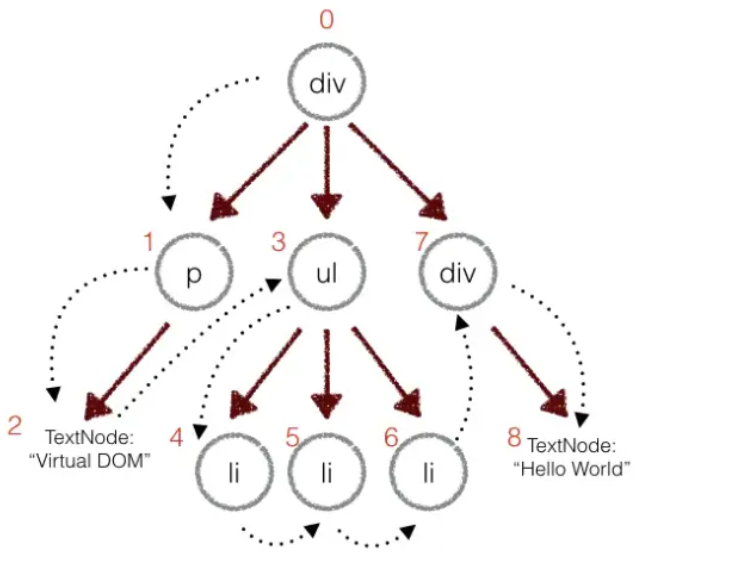
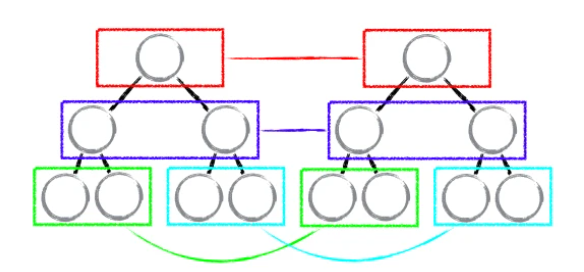
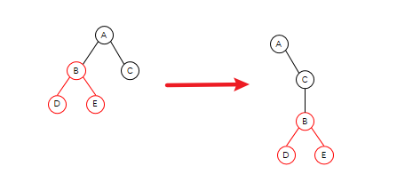
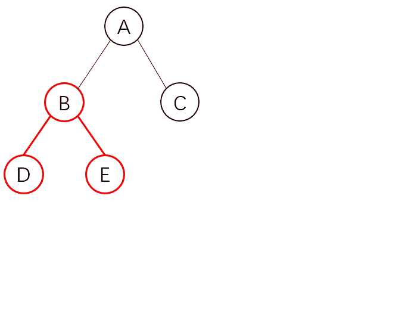
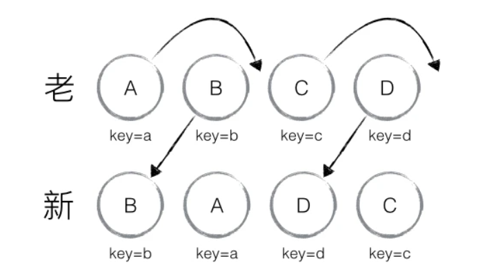

## 前言

在 `beginWork`那一节我们知道了，在 `reconcileChildren` 中，会根据当前的 `current` 是否存在，来判断是进入 `update` 还是 `mount` 的逻辑<br />在 `update`时，会维护两棵虚拟 DOM 树，React 在每次更新时，都会将本次的新的内容与旧的 Fiber 树进行对比，通过 Diff 算法比较他们之间的差异后，构建新的 Fiber 树，将计算好的需要更新的节点放入更新队列中，从而在 commti 阶段，依据这个 Diff 结果，对真实 DOM 进行更新渲染。<br />这样可以确保通过**最小的代价来将旧的 Fiber 树转化为新的 Fiber 树**，以保证 UI 与新的树保持同步

## 虚拟 DOM

虚拟 DOM ，它是一种编程概念，在这个概念里，以一种**虚拟的表现形式被保存在内存**中。在 React 中，render 执行的结果得到的并不是真正的 DOM 节点，而是 JavaScript 对象

> 虚拟 DOM 只保留了真实 DOM 节点的一些**基本属性，和节点之间的层次关系**，它相当于建立在 JavaScript 和 DOM 之间的一层“缓存”

```html
<div class="hello">
    <span>hello world!</span>
</div>
```

上面的这段代码会转化可以转化为虚拟 DOM 结构

```json
{
    tag: "div",
    props: {
        class: "hello"
    },
    children: [{
        tag: "span",
        props: {},
        children: ["hello world!"]
    }]
}
```

其中对于一个节点必备的**三个属性** `tag、props、children`

- tag 指定元素的**标签**类型，如`li`，`div`
- props 指定元素身上的属性，如 `class` ，`style`，自定义属性
- children 指定元素是否有**子节点**，参数以**数组**形式传入

而我们在 render 中编写的 JSX 代码就是一种虚拟 DOM 结构。

## Diff 策略

那么基于多叉树的 Diff 算法，如果需要完整的对比之间的差异，**复杂度会达到 O(n^3)**，也就是 1000 个元素需要进行 10 亿次的比较，这个开销非常之大，React **基于一些策略**，来实现了 O(n) 复杂度的 Diff 算法

1. 只对**同级元素**进行 diff ，如果 dom 前后两次更新跨层级，不会复用，而作为新元素 
2. 两个**不同类型的元素**会产生出不同的树。如 div 变成 p 会将整棵树销毁 
3. 可以通过** key** 来暗示不同的渲染下保持稳定 

<br />而针对这三种策略，分别对应着** **`tree diff`，`component diff` 以及 `element diff` 来进行算法优化

### 按 Tree 层级 Diff

首先会将新旧两个 DOM 树，进行比较，这个比较指的是**分层比较**。又由于 DOM 节点**跨层级的移动操作很少，忽略不计**。React 通过 `updataDepth` 对 虚拟 DOM 树进行层级控制，只会对同层节点进行比较，也就是图中只会对相同颜色方框内的 DOM 节点进行比较。例如：<br />**当对比发现节点消失时，则该节点及其子节点都会被完全删除，不会进行更深层次的比较**，这样只需要对树进行一次遍历，便能完成整颗 DOM 树的比较<br />

这里还有一个值得关注的地方：**DOM 节点跨层级移动**<br />为什么会提出这样的问题呢，在上面的删除原则中，我们发现当节点不存在了就会删除，那我只是给它换位了，它也会删除整个节点及其子节点吗？<br /><br />如图，我们需要实现这样的移动，你可能会以为它会直接这样移动<br /><br />但是实际情况，并不是这样的。由于 React 只会简单的进行同层级节点位置变化，对于不同层级的节点，只有创建和删除操作，当发现 B 节点消失时，就会**销毁 B**，当发现 C 节点上多了 B 节点，就会创建 B 以及它的子节点。<br />**因此这样会非常的复杂，所以 React 官方并不建议我们进行 DOM 节点跨级操作**

### 按 component 层级 diff

在组件层面上，也进行了优化

- 如果是同一类型的组件，则按照原策略继续比较 虚拟 DOM Tree
- 如果不是，则将这个组件记为 `dirty component` ，从而**替换整个组件下的所有子节点**

同时对于同一类型的组件，有可能其 `Virtual DOM` 没有任何变化，如果能够确切的知道这点就可以节省大量的 `diff` 运算的时间，因此 `React` 允许用户通过 `shouldComponentUpdate()` 判断该组件是否需要进行 `diff` 算法分析<br />总的来说，**如果两个组件结构相似，但被认定为了不同类型的组件，则不会比较二者的结构，而是直接删除**

### 按 element 层级 diff

element diff 是专门针对**同一层级的所有节点**的策略。当节点在同一层级时，diff 提供了 3个节点操作方法：插入，移动，删除<br />当我们要完成如图所示操作转化时，会有很大的困难，因为在新老节点比较的过程中，发现每个节点都要**删除再重新创建**，但是这只是重新排序了而已，对性能极大的不友好。因此 React 中提出了优化策略：<br />允许添加**唯一值 key 来区分节点**<br /><br />引入 key 的优化策略，让性能上有了翻天覆地的变化

#### 那 key 有什么作用呢？

当同一层级的节点添加了 key 属性后，当位置发生变化时。react diff 进行新旧节点比较，如果发现有相同的 key 就会进行移动操作，而不会删除再创建

#### 那 key 具体是如何起作用的呢？

首先在 React 中只允许**节点右移**<br />因此对于上图中的转化，只会进行 A，C 的移动<br />则只需要对移动的节点进行更新渲染，不移动的则不需要更新渲染

#### 为什么不能用 index 作为 key 值呢？

`index` 作为 `key` ，如果我们删除了一个节点，那么数组的后一项可能会前移，这个时候移动的节点和删除的节点就是相同的 `key`  ，在`react`中，如果 `key` 相同，就会视为**相同的组件**，但这两个组件是不同的，这样就会出现很麻烦的事情，例如：序号和文本不对应等问题<br />所以一定要保证 `key` 的唯一性

## 建议

React 已经帮我们做了很多了，剩下的需要我们多加注意，才能有更好的性能<br />基于三个策略我们需要注意

- **tree diff 建议**：开发组件时，需要注意保持 DOM 结构稳定
- **component diff 建议**：使用 `shouldComponentUpdate()` 来减少不必要的更新
- **element diff 建议**：减少最后一个节点移动到头部的操作，这样前面的节点都需要移动

---

下节开始，我们将会介绍 React 源码中的 **Diff 算法**的实现，它可以根据**同级节点的数量分为两类**

- 一种是用于 `object`、`number`、`string` 类型的节点，这些都是单一节点的 Diff
- 一种是 `array` 类型的多节点 Diff

我们将分为两节来介绍，下节介绍单一节点的 Diff 算法

## 参考资料

[谈谈React中Diff算法的策略及实现](https://segmentfault.com/a/1190000016539430)<br />[React diff算法](https://segmentfault.com/a/1190000011492275)<br />[浅谈react 虚拟dom，diff算法与key机制](https://juejin.cn/post/6967626390380216334#heading-1)

---
