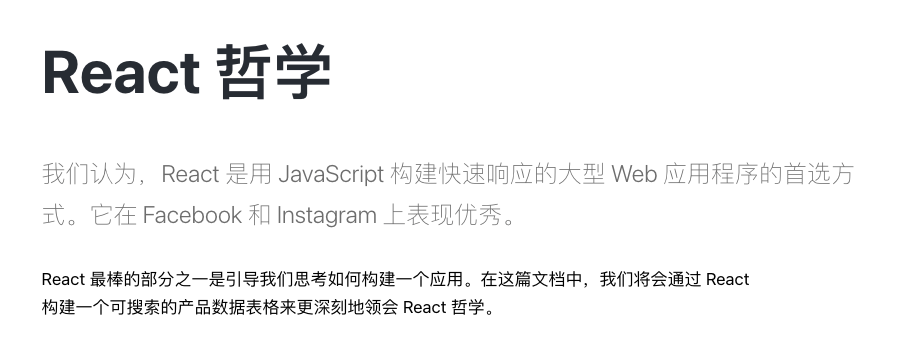
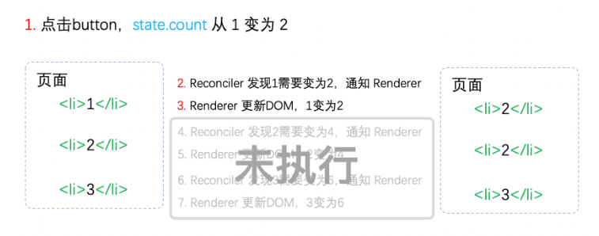

# React 设计理念
React 是用 JavaScript 构建**快速响应**的大型 Web 应用程序的首选方式。

设计理念：快速响应

制约瓶颈：CPU 与 IO 瓶颈

- 当遇到大计算量的操作或者设备性能不足时页面掉帧，**导致卡顿**。
- 发送网络请求后，由于需要等待数据返回才能进一步操作导致不能快速响应。

解决方法：实现异步可中断的更新
# React 架构的演进
## 老的 React 架构（React 15）
React15架构可以分为两层：

- Reconciler（协调器）—— 负责找出变化的组件（Diff 算法）
- Renderer（渲染器）—— 负责将变化的组件渲染到页面上

Diff 算法将上一次更新的组件和本次更新的组件做对比，被判定为需要更新的组件，会被交给渲染器进行渲染，不同的渲染器会将不同的组件渲染到不同的宿主环境的视图中
> ReactDOM 渲染器，ReactNative 渲染器，ReactTest（js 对象），ReactArt（cancas）

### Reconcile 
React 中可以通过 this.setState 等 API 来触发更新，每次 update 时，Reconciler 会做如下工作

- 调用 CC 或 FC 的 render 方法，将 JSX **转化**成 Vitrual DOM
- 将本次的 Virtual DOM 与上次更新时的 Vitrual DOM **对比**
- **找出**本次更新中变化的 Vitrual DOM 节点
- **通知** Renderer 将变化的 Vitrual DOM 渲染到页面上
### Renderer
React 支持跨平台，不同的平台有不同的 Renderer 渲染器

- ReactDOM 渲染器，负责浏览器环境渲染
- [ReactNative](https://www.npmjs.com/package/react-native) 渲染器，渲染 App 原生组件
- [ReactTest](https://www.npmjs.com/package/react-test-renderer) 渲染器，渲染出纯 Js 对象用于测试
- [ReactArt](https://www.npmjs.com/package/react-art) 渲染器，渲染到 Canvas, SVG 或 VML (IE8)

在每次更新发生时，**Renderer**接到 **Reconciler**通知，将变化的组件渲染在当前宿主环境。
## React15 架构的缺点
在 Reconciler 中， mount 组件会调用 mount Component ，update 时会调用 update Component ，这两个方法都会**递归的更新子组件**
### 递归更新的缺点
由于 React 15 会递归的更新子组件，这也造成了它致命的问题，**一旦开始更新，就无法中断**，当组件的层级很深时，无法在一帧内完成更新，又没有办法中断本次更新，用户交互就会变得卡顿

在 React 15 架构中，采用同步更新的方式，Reconciler 和 Renderer 是交替工作的，只有当前一个 DOM 完成了 renderer 才会进入下一个 DOM 的 Reconciler

在用户看来所有的 DOM 是同时更新的。

在前面说到，React 为了践行快速响应的理念，需要实现异步可中断的更新，那么基于 React 15 的架构能够实现吗？

当第一个 li 完成更新时中断更新，即步骤3完成后中断更新，**此时后面的步骤都还未执行**。

用户本来期望 123 变为 246。实际却看见更新不完全的DOM！（即223）
图来自[React 技术揭秘](https://react.iamkasong.com/preparation/oldConstructure.html#react15%E6%9E%B6%E6%9E%84%E7%9A%84%E7%BC%BA%E7%82%B9)
## 新的 React 架构
在 React 16 版本中进行了一次大的重构，React 16 架构**解决了 React 15 不能支撑异步更新的问题**
React16 架构可以分为三层：

- Scheduler（调度器）—— **调度任务的优先级**，高优任务优先进入**Reconciler**
- Reconciler（协调器）—— 负责找出变化的组件
- Renderer（渲染器）—— 负责将变化的组件渲染到页面上

可以看到，相较于 React15，React16 中新增了 **Scheduler**(调度器)模块

在新的架构中，更新首先会被调度器处理，在调度器中会调度这些更新的优先级，更高优的更新会首先进入协调器，在本次更新的 Reconcile 中正在执行 Diff 算法时，**如果此时产生了更高优先级的更新，本次正在协调的更新会被中断，由于 Scheduler 和 Reconcile 都是在视图中完成的操作，因此即使更新中断，用户也不会看到更新不完整的视图**。当某次更新完成了 Reconcile 中的工作时，协调器会通知渲染器，本次更新有哪些组件需要执行对应的视图操作（CRUD），当渲染器完成了它的工作，调度器又会开始新一轮的调度
### Scheduler 
我们知道如果我们的应用占用较长的 js 执行时间，比如超过了设备一帧的时间，那么设备的绘制就会出现卡顿的现象。

Scheduler 主要的功能是**时间切片和调度优先级**，react 在对比差异的时候会占用一定的 js 执行时间，Scheduler 内部借助 MessageChannel 实现了在浏览器绘制之前指定一个时间片，如果 react 在指定时间内没对比完，Scheduler 就会强制交出执行权给浏览器

在 Scheduler 的实现核心是，判断浏览器是否有剩余时间作为任务中断的标准，在部分浏览器中以及实现了这个 API，requestIdle Callback，但是 React 并没有直接使用这个 API ，**而是自行实现了一个功能更加完备的 requestIdleCallback 的 polyfill，也就是 Scheduler。**
### Reconcile 
在 React 15 的 reconcile 协调器中，会通过递归的方式来处理虚拟 DOM ，这样导致 Reconcile 过程无法被中断

在 React 16 中将更新工作从递归变成了可以中断的循环过程，每次循环都会调用 shouldYield 判断当前是否有剩余时间

```javascript
function workLoopConcurrent() {
  // Perform work until Scheduler asks us to yield
  while (workInProgress !== null && !shouldYield()) {
    workInProgress = performUnitOfWork(workInProgress);
  }
}
```

**那么 React 16 是如何解决更新中断时 DOM 渲染不完全的问题呢？**

在 React 16 中，Reconciler 与 Renderer **不再是交替工作**。当 Scheduler 调度器将任务交给 Reconciler 后，Reconciler **会为变化的 DOM 打上标记 effectTag**

```javascript
export const Placement = /*             */ 0b0000000000010;
export const Update = /*                */ 0b0000000000100;
export const PlacementAndUpdate = /*    */ 0b0000000000110;
export const Deletion = /*              */ 0b0000000001000;
```

只有再所有组件都完成了 Reconciler 的工作，才会统一交给 Renderer 渲染器进行更新渲染

### Renderer
Renderer 会根据 Reconciler 中为虚拟 DOM 打的 tag，**同步执行**对应的 DOM 操作

以上就是 React 的设计理念以及新老架构的演变
          