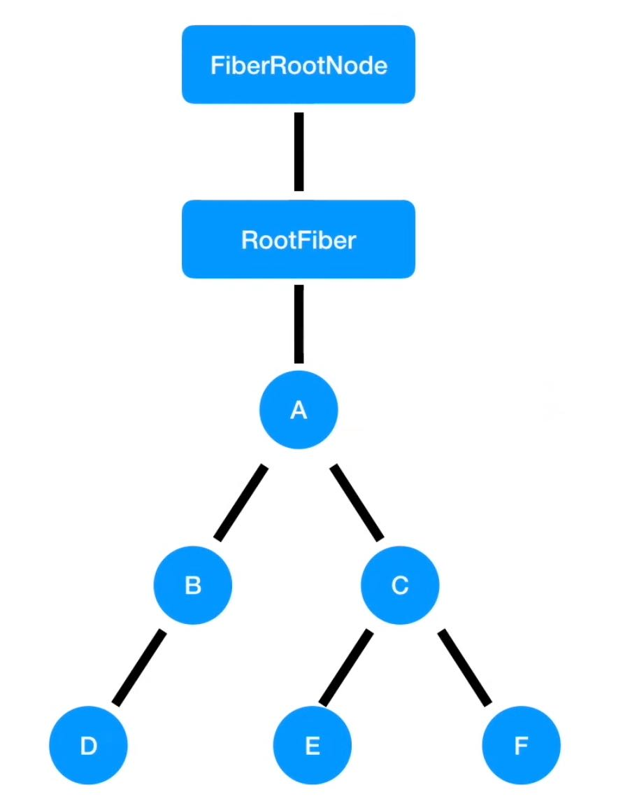

## 前言

在 React 18 的更新中，全面启用了 `concurrent` 模式，使用 `legacy` 模式将会报 **warning 警告**，可以看出 `concurrent` 模式会是 React 的未来。<br />
`legacy` 模式是我们之前常用的，它**构建 dom 的过程是同步的**，所以在 `reconcile` 阶段的 Diff 中，如果特别耗时，那么导致的结果就是 js 会一直**阻塞高优先级的任务**，表现为页面的卡顿和无法响应。<br />`concurrent` 模式是 react 18 中全面开启的模式，它用**时间片调度实现了异步可中断**的任务，根据设备性能的不同，时间片的长度也不一样，在每个时间片中，如果任务到了过期时间，就会主动让出线程给高优先级的任务。<br />采用 `ReactDOM.render` 来渲染的应用，就是 `legacy` 模式，都是同步的，在状态更新时没有优先级的概念，任务之间需要依次执行。<br />对于 `concurrent` 模式和 `blocking` 模式来说，也就是采用 `ReactDOM.createRoot` 或 `ReactDOM.createBlockingRoot` 创建的应用，会采用并发的方式来更新状态。**当有高优先级任务存在时，会中断当前正在执行的低优先级任务，先完成高优先级更新后，再基于更新结果重新进行低优先级的更新。**

> blocking mode 是实验中的模式，为了 legacy 迁移至 concurrent 而存在

**那么什么是优先级呢？**
## 优先级与Update

> 优先级的概念只存在与 concurrent 模式中

React 源码中优先级的分类，一共有以下 6 种优先级

```javascript
export type PriorityLevel = 0 | 1 | 2 | 3 | 4 | 5;

// TODO: Use symbols?
export const NoPriority = 0;
export const ImmediatePriority = 1; // 最高
export const UserBlockingPriority = 2; // 用户触发的更新，onClick 等
export const NormalPriority = 3; // 一般的优先级，请求数据更新状态
export const LowPriority = 4; // 
export const IdlePriority = 5; // 空闲优先级
```

优先级的计算公式，只执行**高于本次更新**的优先级的 Update<br />baseState + Update1（NormalPriority） + Update2（UserBlockingPriority） = newState<br />对于上面的公式来说，`Update2` 的优先级高于 `Update1`，那么会先执行 `Update2` 的更新，再基于 `Update2` 更新的结果进行 `Update1` 的更新，也就是下面两步

1. `baseState` + `Update2` = `newState1`
1. `newState1` + `Update1` = `newState`

在知道了不同事件触发更新的优先级之后，我们再来看看它的更新流程

## 更新流程

在上面我们知道了不同优先级的更新会有中断的可能，那么具体流程是怎么样的呢，我们通过下面这个例子来了解一下<br />下图是一个组件树的结构，F 组件触发了一次更新，它的优先级是 **NormalPriority**。<br />可以假设是在 `componentDidMount` 中去请求了一次数据，在请求成功后调用了 `setState` 去更新状态，这里调用 `setState` 就会创建一次更新，因此这个更新的优先级是 **NormalPriority**<br />

- 首先它会从当前的 Fiber 节点，也就是 F 节点，开始向上遍历，并通知沿途的 Fiber 节点有更新，一直到 `FiberRootNode`，在 `FiberRootNode` 上保存当前更新的优先级，在这里就是 **NormalPriority**
- 接下来，就会以 **NormalPriority** 优先级，来调度整个应用的根节点 `FiberRootNode`，整个应用中只有一个被调度的任务，它的优先级是 **NormalPriority**，于是就调用 **NormalPriority** 的回调函数，这个回调函数就是 `render` 阶段的入口，由于优先级是作用在**整个组件树**的，我们会从 `FiberRootNode` 开始向下，采用深度优先遍历的方式，依次以 **NormalPriority** 来执行每一个组件的 Diff 
- 在这个组件树中，只有 F 组件存在 **NormalPriority**  优先级对应的 Update，因此只有 F 组件会在 Diff 中得到一个 state
- 如果在这个计算过程中，F 组件**又触发了一次更新**，这个更新的优先级是 `UserBlockingPriority`，那么又会从 F 组件向上遍历，直到 `FiberRootNode`，mark 一下
- 注册一个 `UserBlockingPriority` 的调度，接下来 scheduler 就会调度，**NormalPriority** 和 `UserBlockingPriority`，`UserBlockingPriority` 的优先级高于 **NormalPriority** 
- 因此之前正在执行的 **NormalPriority** 的 `render` 阶段就会被中断，重新从根节点向下深度优先遍历，执行 `UserBlockingPriority` 优先级的更新
- 在执行完 `render --> commit` 阶段后，基于当前的计算结果，再去执行刚刚被中断的低先级的更新

## 例子

> 例子学习自：[React 技术揭秘](https://react.iamkasong.com/)

在下面的例子中，通过 `useEffect` 触发了两个更新，一个是 `useState` 的回调更新，一个是**事件触发的更新**，`onClick` 触发的更新优先级比 `normal` 要高，又因为我们两次更新时间间隔很短，并且操作很多，第一次更新还没有在 20ms 内完成就触发了优先级更高的更新，因此会调度 `normal` 和 `userBlocking` 两个优先级的事件，`userBlocking` 优先级的更新，会中断正在执行的 `normal` 的 render 阶段<br />因此页面会从 0 变为 2 再变为 3 

```javascript
const [count, updateCount] = useState(0)
const buttonRef = useRef(null)

const onClick = () => {
  updateCount(count => count + 2)
}

useEffect(() => {
  const button = buttonRef.current
  setTimeout(() => updateCount(1), 1000)
  setTimeout(() => button.click(), 1020)
},[])

return (
  <div className="App">
    <button ref={buttonRef} onClick={onClick}>
      增加 2
    </button>
    <div>
      {
        Array.from(new Array(4000)).map((v, index) => (
          <span key={index}>{count}</span>
        ))
      }
    </div>
  </div>
);
```

以上的讨论都是基于 concurrent mode 下进行的，如果是在同步模式下，也就是 ReactDOM.render ，页面的结果展示将会是从 0 变为 1 变为 3，这是因为同步模式下没有优先级的概念，不会中断第一次的 updateCount

## 参考资料

[React 技术揭秘](https://react.iamkasong.com/)