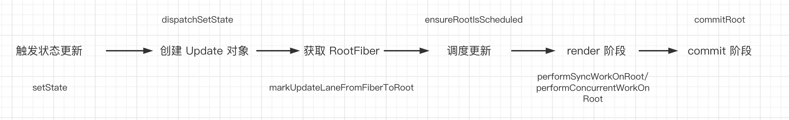

## 前言

前面我们讲了 `render` 阶段和 `commit` 阶段的工作，讲了 `render` 阶段中 Diff 算法的实现，现在我们已经对整体的流程有了一定的认识

- 在 `render` 阶段的 `beginWork` 阶段会创建子 `Fiber` 节点，通过 Diff 算法，打上相应的 `effectTag`
- 在 `render` 阶段的 `completeWork` 阶段会根据 `Fiber` 节点生成对应的 `DOM` 节点，并连接子节点
- 在 `commit` 阶段会对所有的 `effectTag` 执行相应的 DOM 操作，更新视图

在这些流程之前还有着，从触发状态更新到 `render` 阶段的过程，也就是我们本章需要学习的内容：**状态更新**

## 最小更新单元

对于一个组件来说，如果想要触发更新，那么可以有以下这些情况

- 组件本身的 state 改变
- 组件 props 的改变，父组件导致子组件更新
- context 改变，该组件消费的 context 发生了更新

但是归根结底，无论是哪种场景下触发的更新，最终的本质都是 `state` 的变化导致的 对于 React 来说，能够触发 state 更新的基本都是在组件层面上，毕竟 Fiber 没有办法自我更新，只能依赖组件进行更新 `state` 因此，**最小的更新单元是组件，更新源自于 state 的变化**

## 触发更新

组件是最小的更新单元，那么我们可以知道，触发更新可以分为

- 类组件的 `setstate` 更新
- 函数组件的 `useState` 状态更新

## 创建 Update 对象

首先，每次状态更新都会创建一个保存更新状态内容的对象，也就是 Update 对象，保存在 updateQueue 链表中，记录当前 Fiber 收集到的更新。在 `render` 阶段的 `beginWork` 中会根据 `Update` 对象来计算新的 `state` ) 这个 Update 会被保存在一个 环状链表中，接下来会调用 `scheduleUpdateOnFiber`中，调度这个 Update

## 标记 RootFiber

`render` 阶段是从 `rootFiber` 开始向下遍历，因此我们需要在 `render` 阶段开始之前，让 `rootFiber` 知道本次调度的相关信息。 因此我们需要从当前触发更新的节点对应的 Fiber 一直遍历到应用的根节点 rootFiber，并通知沿途的 Fiber，你有子孙节点被更新了，打上本次本次触发更新的优先级，并返回 rootFiber 这一步叫做 `markUpdateLaneFromFiberToRoot` 

## 调度更新

经过了上面的处理，我们已经获取到了 RootFiber，并且在这个 Fiber 上以及标记了子树中的 Update 接下来，需要通知 Scheduler 调度器来根据更新的优先级，以及任务的类型，来发起异步或是同步的更新调度，这一步调用的是 `ensureRootIsScheduled` 方法

- 对于 legacy 模式下，最后执行的是 `performSyncWorkOnRoot` 方法
- 对于 concurrent 模式，最后执行的是  `performConcurrentWorkOnRoot` 方法

## 总结

当调度的回调函数被执行，会进入 `render` 阶段

- 在 `render` 阶段的 `reconcile` 也就是 diff 算法中，会根据 `Update` 对象，返回对应的 `state`，根据 `state` 判断本次是否需要更新视图，如果需要更新视图就会被标记为 `effectTag`
- 在 `commit` 阶段，标记了 `effectTag` 的 `Fiber`，就会执行对应的视图更新

