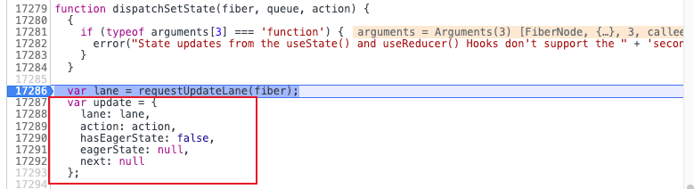
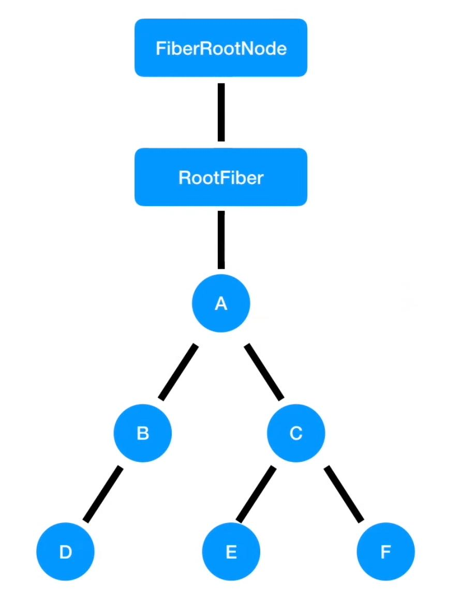
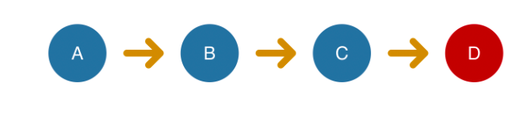
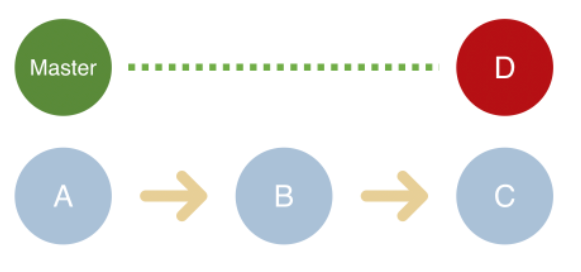
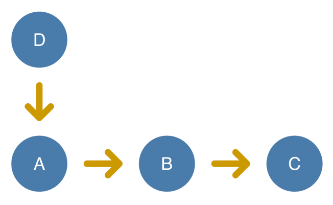
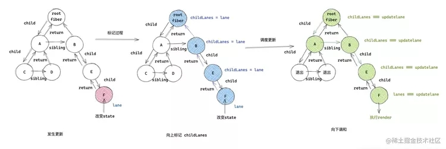
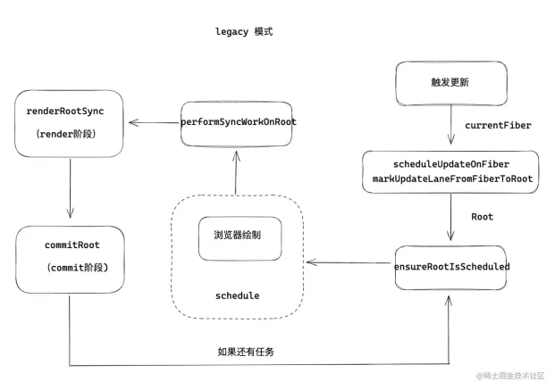

# 流程概览

1. 在 render 阶段执行 reconcile 也就是 Diff 算法，
1. diff 的结果会交给 commit 阶段，commit 阶段执行视图更新

## render 阶段的开始

render 阶段开始于`performSyncWorkOnRoot` 或 `performConcurrentWorkOnRoot` 方法的调用。这取决于本次更新是同步更新还是异步更新。<br />concurrent 模式（并发）下，我们的更新会获得不同的优先级，不同的优先级会以异步的方式调度执行<br />`ReactDOM.render`创建的应用都是同步的应用，也就是所有的更新都是同步的

## 触发更新

在 react 中触发状态更新的几种方式：

- ReactDOM.render
- this.setState
- this.forceUpdate
- useState
- useReducer

这些方法调用的场景各不相同，他们是如何接入同一套**状态更新机制**呢，也就是 render 到 commit 这套流程呢？<br />答案是：每次状态更新都会创建一个保存**更新状态相关内容**的对象，我们叫他 Update。在 render 阶段的beginWork 中会根据 Update 计算新的 state。<br />对于 FC 来说，useState 触发的更新会依次调用 `dispatchAction(dispatchSetState) --> performSyncWorkOnRoot -- > commitRoot`

# 大体调度流程

我们通过 useState 的更新函数来触发一次更新

> 在 `dispatchSetState`、`performSyncWorkOnRoot`、`commitRoot` 上打上断点

在 dispatchAction 到 performSyncWorkOnRoot 的过程中，会进行更新调度的过程

### 创建 Update 对象

<br />这个 Update 会被保存在一个 环状链表中，接下来会调用 `scheduleUpdateOnFiber`中，调度这个 Update

> 为什么要保存在环状链表中呢？

### 从 Fiber 到 Root，获取 RootFiber

render 阶段是从 rootFiber 开始向下遍历，因此我们需要在 render 阶段开始之前，让 rootFiber 知道本次调度的相关信息。那么如何从触发状态更新的 fiber 得到 rootFiber 呢？

> 我们知道在 render 阶段我们会从 Root Fiber 一直向下深度优先的遍历

我们触发更新的是 App 这个 FC，因此我们需要从这个 FC 对应的 Fiber 一直遍历到 应用的根节点<br />这一步叫做 `markUpdateLaneFromFiberToRoot` 

> 该方法做的工作可以概括为：从触发状态更新的 fiber 一直向上遍历到 rootFiber，并返回 rootFiber。

### 调度更新

现在我们已经得到了 RootFiber，该 RootFiber 对应的 Fiber 树中存在某个 Fiber 节点包含一个 Update。<br />接下来就是，通知 Scheduler 根据更新的优先级，决定是以同步还是异步的方式来调度本次更新<br />调用的方法是  `ensureRootIsScheduled`

```javascript
// 判断同步还是异步
if (newCallbackPriority === SyncLanePriority) {
  // 任务已经过期，需要同步执行render阶段
  newCallbackNode = scheduleSyncCallback(
    performSyncWorkOnRoot.bind(null, root)
  );
} else {
  // 根据任务优先级异步执行render阶段
  // 由于这里需要交给 scheduler 进行调度，因此需要将优先级进行转换
  var schedulerPriorityLevel = lanePriorityToSchedulerPriority(
    newCallbackPriority
  );
  // 找到优先级高的来执行
  newCallbackNode = scheduleCallback(
    schedulerPriorityLevel,
    performConcurrentWorkOnRoot.bind(null, root)
  );
}
```

其中，scheduleCallback 和 scheduleSyncCallback 会调用 Scheduler 提供的调度方法根据优先级调度回调函数执行。<br />可以看到，这里调度的回调函数为：

```javascript
performSyncWorkOnRoot.bind(null, root);
performConcurrentWorkOnRoot.bind(null, root);
```

<br />当调度的回调函数被执行，会进入 render 阶段，在render 阶段的 reconcile 也就是 diff 算法中，会根据 Update 对象，返回对应的 state，根据 state 判断本次是否需要更新视图，如果需要更新视图就会被标记为 effectTag，在 commit 阶段，标记了 effectTag 的 Fiber，就会执行对应的视图更新

# 优先级与Update

> 优先级的概念只存在与 concurrent 模式中

React 中的优先级

```javascript
export type PriorityLevel = 0 | 1 | 2 | 3 | 4 | 5;

// TODO: Use symbols?
export const NoPriority = 0;
export const ImmediatePriority = 1; // 最高
export const UserBlockingPriority = 2; // 用户触发的更新，onClick 等
export const NormalPriority = 3; // 一般的优先级，请求数据更新状态
export const LowPriority = 4; // 
export const IdlePriority = 5; // 空闲优先级
```

优先级计算公式，只执行高于本次更新的优先级的 Update<br />baseState + Update1（NormalPriority） + Update2（UserBlockingPriority） = newState

1. baseState + Update2 = newState1
1. newState1 + Update1 = newState

在知道了不同事件触发更新的优先级之后，我们来看看它的更新流程

## 优先级更新中断

<br />假设 F 组件触发了一次更新，它的优先级是 NormalPriority，可以假设是在 componentDidMount 中去请求了一次数据，在请求成功后调用了 setState 去更新状态<br />这里调用 setState 就会创建一次更新，这个更新的优先级就是 NormalPriority

1. 接下来会从当前这个 Fiber 向上遍历，一直到 FiberRootNode，在 FiberRootNode 中保存一个 NormalPriority
2. 接下来，就会以 NormalPriority 来调度整个应用的根节点 FiberRootNode，整个应用中只有一个被调度的任务，他的优先级是 NormalPriority，于是就调用 NormalPriority 的回调函数，这个回调函数就是 render 阶段的入口，由于优先级是作用在整个组件树的，我们会从 FiberRootNode 开始向下，采用深度优先遍历的方式，依次以 NormalPriority 来执行每一个组件的 Diff 
3. 在这个组件树中，只有 F 这个组件存在一个 NormalPriority 对应的 Update，因此只有 F 会 Diff 得到一个 state
4. 如果在这个计算过程中，F 又触发了一次更新，这个更新的优先级是 UserBlockingPriority，那么又会从 F 组件向上遍历，直到 FiberRootNode
5. 注册一个 UserBlockingPriority 的调度，接下来 scheduler 就会调度，NormalPriority 和 UserBlockingPriority，UserBlockingPriority的优先级高于 NormalPriority 
6. 因此之前正在执行的 NormalPriority 的 render 阶段就会被中断，重新从根节点向下深度优先遍历，执行 UserBlockingPriority 的更新

> Update 存在于某个Fiber 中

## 例子

在下面的例子中，通过 useEffect 触发了两个更新，一个是 useState 的回调更新，一个是事件触发的更新，onClick 触发的更新优先级比 normal 要高，又因为我们两次更新时间间隔很短，并且操作很多，第一次更新还没有在 20ms 内完成就触发了优先级更高的更新，因此会调度 normal 和 userBlocking 两个优先级的事件，先执行 userBlocking 的更新，中断正在执行的 normal 的 render 阶段<br />因此页面会从 0 变为 2 再变为 3 

```javascript
const [count, updateCount] = useState(0)
const buttonRef = useRef(null)

const onClick = () => {
  updateCount(count => count + 2)
}

useEffect(() => {
  const button = buttonRef.current
  setTimeout(() => updateCount(1), 1000)
  setTimeout(() => button.click(), 1020)
},[])

return (
  <div className="App">
    <button ref={buttonRef} onClick={onClick}>
      增加 2
    </button>
    <div>
      {
        Array.from(new Array(4000)).map((v, index) => (
          <span key={index}>{count}</span>
        ))
      }
    </div>
  </div>
);
```

以上的讨论都是基于 concurrent mode 下进行的，如果是在同步模式下，也就是 ReactDOM.render ，页面的结果展示将会是从 0 变为 1 变为 3，这是因为同步模式下没有优先级的概念，不会中断第一次的 updateCount

# Update 的计算

类似于 Git 提交

## 同步更新的 React

<br />在React中，所有通过ReactDOM.render创建的应用，都是通过同步的，没有优先级的概念，高优先级的更新需要排在已经开始的其他更新后面执行

## 并发更新的 React

在 React 中，通过 ReactDOM.createBlockingRoot 和 ReactDOM.createRoot 创建的应用会采用并发的方式更新状态。<br />高优更新也就是红色节点，会中断当前正在进行的低优先级的节点（蓝色），先完成 render - commit 流程，待高优先级更新完成后，低优先级更新基于高优先级的结果重新更新<br /><br />这两种更新理念，也和 Git 版本控制类似，在 同步更新就好比在 master 分支上直接开发，再遇到高优先级 bug 时，需要先将代码全部提交之后，才能开始处理高优先级 bug<br />而并发更新就好比我们从 master 上切出一个分支来先处理这个高优先级的 bug，git rebase 命令与 master 合并，基于修复好的高优先级 bug 版本 继续开发

> Fiber 整体流程：
> ①setState 促发在 updateQueue 中插入一个更新记录，向上回溯直至最顶端的 HostRoot，通知沿途节点有子孙节点被更新。
> ②beginWork 是在深度优先遍历中对节点执行创建/更新，执行部分生命周期，给 Fiber 节点打上 effectTag。 ③completeUnitOfWork 向上回溯并生成 effect list（副作用列表，即具体操作 DOM 指令）。

# 运行机制三问：

①任务如何按时间片拆分、时间片间如何中断与恢复？<br />②任务是怎样划分优先级的？<br />③如何让高优先级任务后生成而先执行，低优先级任务如何恢复

# `markUpdateLaneFromFiberToRoot` 如何标记优先级？

react-reconciler/src/ReactFiberWorkLoop.new.js -> markUpdateLaneFromFiberToRoot

```javascript
/**
 * @param {*} sourceFiber 发生 state 变化的fiber ，比如组件 A 触发了 useState ，那么组件 A 对应的 fiber 就是 sourceFiber
 * @param {*} lane        产生的更新优先级
 */
function markUpdateLaneFromFiberToRoot(sourceFiber,lane){
    /* 更新当前 fiber 上 */
    sourceFiber.lanes = mergeLanes(sourceFiber.lanes, lane);
    /* 更新缓存树上的 lanes */
    let alternate = sourceFiber.alternate;
    if (alternate !== null) alternate.lanes = mergeLanes(alternate.lanes, lane);
    /* 当前更新的 fiber */
    let node = sourceFiber;
    /* 找到返回父级 */
    let parent = sourceFiber.return;
    while(parent !== null){
        /* TODO: 更新 childLanes 字段 */
        parent.childLanes = mergeLanes(parent.childLanes, lane);
        if (alternate !== null) {  alternate.childLanes = mergeLanes(alternate.childLanes, lane); }
        /* 递归遍历更新 */
        node = parent;
        parent = parent.return;
    }
}
```

markUpdateLaneFromFiberToRoot 做的事很重要。

- 首先会更新当前 fiber 上的更新优先级。fiber 架构采用 ‘连体婴’形式的双缓冲树，所以还要更新当前 fiber 的缓冲树 alternate 上的优先级。
- 然后会递归向上把父级连上的 childLanes 都更新，更新成当前的任务优先级。

**重点想一想为什么向上递归更新父级的 childLanes ？**

- 首先通过 fiber 章节我们知道，所有的 fiber 是通过一颗 fiber 树关联到一起的，如果组件 A 发生一次更新，React 是从 rootFiber 开始深度遍历更新 fiber 树。
- 那么更新过程中需要深度遍历整个 fiber 树吗？当然也不是，那么只有一个组件更新，所有的 fiber 节点都调和无疑是性能上的浪费。

**既然要从头更新，又不想调和整个 fiber 树，那么如何找到更新的组件 A 呢？**

- 这个时候 **childLanes** 就派上用场了，如果 A 发生了更新，那么先向上递归更新父级链的 childLanes，接下来从 Root Fiber 向下调和的时候，发现 childLanes 等于当前更新优先级 updateLanes，那么说明它的 child 链上有新的更新任务，则会继续向下调和，反之退出调和流程。

**那么 React 从 Root fiber 开始调和的时候，是如何找到更新的事发点 Index 的呢？**，**Root Fiber 是通过 childLanes 逐渐向下调和找到需要更新的组件的。**<br />为了更清晰的了解流程这里画了一个流程图。如下：<br /> 上面描述了整个 fiber 树调和流程。

- 第一阶段是发生更新，那么产生一个更新优先级 lane 。
- 第二阶段向上标记 childLanes 过程。
- 第三阶段是向下调和过程，有的同学会问，为什么 A 会被调和，原因是 A 和 B 是同级，如果父级元素调和，并且向下调和，那么父级的第一级子链上的 fiber 都会进入调和流程。从 fiber 关系上看，Root 先调和的是 child 指针上的 A ，然后 A 会退出向下调和，接下来才是 sibling B，接下来 B 会向下调和，通过 childLanes 找到当事人 F，然后 F 会触发 render 更新。这也就解决问题2，Child2 的调和问题。

通过上述我们知道了如何找到 F 并执行 render 的，那么还有一个问题，就是 B，E 会向下调和，如果它们是组件，那么会 render 么，答案是否定的，要记住的是**调和过程并非 render 过程**，调和过程有可能会触发 render 函数，也有可能只是继续向下调和，而本身不会执行 render 。<br />既然知道了如何去更新 childLanes ，以及更新 childLanes 的意义，我们接着向下分析流程。<br />**在 scheduleUpdateOnFiber 中，最后会调用 ensureRootIsScheduled ，那么它的作用又是什么呢？**<br />由于 ensureRootIsScheduled 源码比较繁琐，这里就不占篇幅了，它的作用就是根据任务的类型，发起异步调度任务，在调度章节已经讲了调度流程。接下来会走调度的流程。

- 对于 legacy sync 模式最后的更新任务是 performSyncWorkOnRoot 。
- 对于 Concurrent 模式最后的更新任务是 performConcurrentWorkOnRoot。

我们今天主要讲的是组件 beginWork 更新流程，所以这里主要以 legacy 模式为主，所以跟着 performSyncWorkOnRoot 流程往下看：<br />react-reconciler/src/ReactFiberWorkLoop.new.js -> performSyncWorkOnRoot

```javascript
function performSyncWorkOnRoot(root) {
    /* render 阶段 */
    let exitStatus = renderRootSync(root, lanes);
    /* commit 阶段 */
    commitRoot(root);
    /* 如果有其他的等待中的任务，那么继续更新 */
    ensureRootIsScheduled(root, now());
}
```

调和的两大阶段 render 和 commit 都在这个函数中执行。

- renderRootSync 代表 render 阶段。
- commitRoot 代表 commit 阶段。
- 当 render 和 commit 阶段执行之后，如果有其他的等待中的任务，那么继续执行调度任务。

到此为止，一次更新调度任务的初始化工作完成。开始正式进入调和阶段。我对前戏阶段做一下总结，流程图如下：<br />