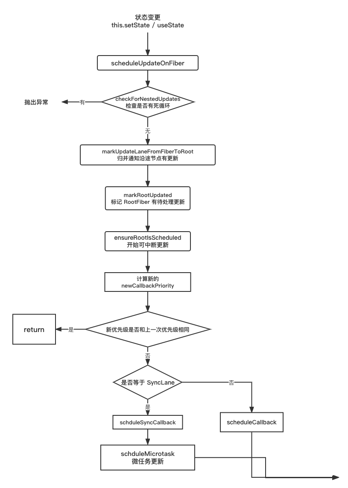

## 前言

在前面几节，我们介绍了 React 中，状态更新的主要流程，以及 `concurrent` 模式下，优先级的概念以及优先级更新的流程，本节我们将从源码的角度来解析 React 是如何实现状态更新的。<br />无论是 `setState` 还是 `useState` 进行的更新，**都会**创建更新任务，也就是创建 Update 对象，并添加到 Fiber 的 `UpdateQueue` 中，如果是 Function Component 会添加到 `baseQueue` 中。<br />接下来就会进入核心的 `reconciler` 阶段，主要分为 4 个子阶段

1. 任务输入：触发的更新都会 dispatch 到 `scheduleUpdateOnFiber` 这个函数中，来处理更新任务
1. 调度任务：通过 `Scheduler` 来调度任务，等待空闲时间回调
1. 执行任务会调：构造 Fiber 树，`render` 阶段的 `completeWork` 阶段会创建 Fiber 对应的 DOM 节点
1. 输出 DOM 节点：`commit` 阶段会与渲染器交互，渲染出 DOM 节点

对于**不同形式触发**的状态更新来说，它们都会进入**一套相同的 render 到 commit 的流程**，这是因为在每次更新时都会创建一个保存**更新状态相关内容**的对象 **Update**。在 render 阶段的**beginWork** 中会根据 Update 来计算 `newState`<br />**在初始化阶段完成之后，如果触发了 state 的更新，那么会发生什么呢？**

## 触发更新

以 `useState` 和 `setState` 来分别看函数组件和类组件的更新流程

### 类组件 

触发 `setState`本质上是调用了 `enqueueSetState`

```javascript
enqueueSetState(inst,payload,callback){
    const update = createUpdate(eventTime, lane);
    ...
    enqueueUpdate(fiber, update, lane);
    ...
    const root = scheduleUpdateOnFiber(fiber, lane, eventTime);
}
```

### 函数组件

对于函数组件而言，会调用 `dispatchSetState`

```javascript
function dispatchSetState(fiber, queue, action) {
    const lane = requestUpdateLane(fiber);
    const update: Update<S, A> = {
      lane,
      action,
      hasEagerState: false,
      eagerState: null,
      next: (null: any),
    };
    ...
    scheduleUpdateOnFiber(fiber, lane, eventTime);
}
```

无论是通过什么方式来触发，都会**创建一个 Update 对象**，这样验证了我们之前一直所说的，然后它会被**保存到环状链表 pending 中**，最后都是会**调用** `scheduleUpdateOnFiber` 方法，这个也就是整个更新的入口，接下来我们看看它都做了些什么

## 更新入口 scheduleUpdateOnFiber

从前面我们知道了，无论是什么方式触发的更新，最后都会调用 `scheduleUpdateOnFiber`方法，这也是任务调度的入口，它的核心代码如下

```javascript
// react-reconciler/src/ReactFiberWorkLoop.new.js
export function scheduleUpdateOnFiber(
  fiber: Fiber,
  lane: Lane,
  eventTime: number,
): FiberRoot | null {
  // 检查是否有死循环
  checkForNestedUpdates();
  ...
  // 自底向上标记更新优先级
  const root = markUpdateLaneFromFiberToRoot(fiber, lane);
  ...
  // 标记 root 有更新，lane 插入到 root.pendingLanes 中
  markRootUpdated(root, lane, eventTime);
  ...
  if (root === workInProgressRoot) {
    // 在渲染过程中接收到一个更新，在根节点上标记一个交错更新，
    if (
      deferRenderPhaseUpdateToNextBatch ||
      (executionContext & RenderContext) === NoContext
    ) {
      workInProgressRootUpdatedLanes = mergeLanes(
        workInProgressRootUpdatedLanes,
        lane,
      );
    }
    if (workInProgressRootExitStatus === RootSuspendedWithDelay) {
      // 执行高优先级更新
      markRootSuspended(root, workInProgressRootRenderLanes);
    }
  }

  // 执行可中断更新
  ensureRootIsScheduled(root, eventTime);
  ...
  return root;
}
```

### 1.检查是否死循环 checkForNestedUpdates

在 `scheduleUpdateOnFiber` 函数中，首先会调用 `checkForNestedUpdates` 方法，检查是否有嵌套更新，也可以说是循环更新，无限调用，这种情况会抛出异常<br />这里的 `NESTED_UPDATE_LIMIT` 的值是 50，也就是说当循环次数超过 50 次时，会认为是死循环，会抛出错误

```javascript
function checkForNestedUpdates() {
 
  if (nestedUpdateCount > NESTED_UPDATE_LIMIT) {
    nestedUpdateCount = 0;
    rootWithNestedUpdates = null;
    throw new Error(
      'Maximum update depth exceeded. This can happen when a component ' +
        'repeatedly calls setState inside componentWillUpdate or ' +
        'componentDidUpdate. React limits the number of nested updates to ' +
        'prevent infinite loops.',
    );
  }
}
```

### 2.递归向上通知 parent 有更新 markUpdateLaneFromFiberToRoot

接下来，会调用 `markUpdateLaneFromFiberToRoot` 方法，更新当前 Fiber 节点的 `lanes` 字段，并向上归并在父节点的 `childLanes` 字段中添加为本次更新的优先级 `lanes`。最后返回当前的 rootFiber 节点<br />**注意这里会对 Fiber 节点的 alternate Fiber 的 lane 进行更新，这个非常重要，下一节会讲到**

```javascript
function markUpdateLaneFromFiberToRoot(
  sourceFiber: Fiber,
  lane: Lane,
): FiberRoot | null {
  // 更新当前 Fiber 的优先级
  sourceFiber.lanes = mergeLanes(sourceFiber.lanes, lane);
  let alternate = sourceFiber.alternate;
  if (alternate !== null) {
    alternate.lanes = mergeLanes(alternate.lanes, lane);
  }

  let node = sourceFiber;
  let parent = sourceFiber.return;
  // 归并更新 父节点 的优先级
  while (parent !== null) {
    parent.childLanes = mergeLanes(parent.childLanes, lane);
    alternate = parent.alternate;
    if (alternate !== null) {
      alternate.childLanes = mergeLanes(alternate.childLanes, lane);
    }
    node = parent;
    parent = parent.return;
  }
  if (node.tag === HostRoot) {
    const root: FiberRoot = node.stateNode;
    return root;
  } else {
    return null;
  }
}

```

这里采用 `mergeLanes` 来合并优先级，因为可能会有多个更新存在，都需要在后续进行调度，lanes 更新的操作很简单，只需要将当前的优先级 `lane` 与之前的 `lane` 进行**二进制或运算**即可

```javascript
export function mergeLanes(a: Lanes | Lane, b: Lanes | Lane): Lanes {
  return a | b;
}
```

### 3. 标记 RootFiber 有待处理更新

接下来会将更新的 lane 通过二进制运算添加到 root Fiber 的 `pendingLanes` 中，在 root Fiber 标记一个更新

```javascript
export function markRootUpdated(
  root: FiberRoot,
  updateLane: Lane,
  eventTime: number,
) {
  // 设置更新的优先级
  root.pendingLanes |= updateLane;

  if (updateLane !== IdleLane) {
    root.suspendedLanes = NoLanes;
    root.pingedLanes = NoLanes;
  }
  const eventTimes = root.eventTimes;
  const index = laneToIndex(updateLane);
  eventTimes[index] = eventTime;
}
```

### 4. 开始可中断更新 ensureRootIsScheduled

在函数的最后，会调用 `ensureRootIsScheduled` 方法，传入已经被标记过的 root Fiber 节点以及创建 update 的时间，开始可中断更新

```javascript
ensureRootIsScheduled(root, eventTime);
```

接下来详细看看 `ensureRootIsScheduled` 方法做了什么

## 注册调度任务

`ensureRootIsScheduled` 函数的作用是为 `root` 安排调度任务，每个更新任务的 `update` 都会经过 `ensureRootIsScheduled` 的处理，它主要会做以下几件事：

- 首先会计算**最新的调度更新优先级**  `newCallbackPriority` ，判断是否和 `rootFiber` 上的 `calllbackPriority` 优先级是否相等，如果相等，则会因为**优先级没有改变，重用当前任务**，直接退出
- 如果不相等，会进入真正的调度任务函数 `sheduleSyncCallback` 函数中 
- 最后会将 `newCallbackPriority` 赋值给`callbackPriority`

核心代码如下

```javascript
// 注册任务
function ensureRootIsScheduled(root: FiberRoot, currentTime: number) {
  ...
  // 注册的新任务
  let newCallbackNode;
  // 如果新渲染任务的优先级是同步优先级
  // if 逻辑处理的是同步任务，同步任务不需经过 Scheduler
  if (newCallbackPriority === SyncLane) {
    // 同步任务不经过 Scheduler
    if (root.tag === LegacyRoot) {
      // Legacy 模式
      scheduleLegacySyncCallback(performSyncWorkOnRoot.bind(null, root));
    } else {
      // 非 legacy模式
      scheduleSyncCallback(performSyncWorkOnRoot.bind(null, root));
    }
    // React18 新增加的
    if (supportsMicrotasks) {
        scheduleMicrotask(() => {
          if (executionContext === NoContext) {
            flushSyncCallbacks();
          }
        });
    } else {
      scheduleCallback(ImmediateSchedulerPriority, flushSyncCallbacks);
    }
    ...
  } else {
    ...
    // 调度优先级任务
    newCallbackNode = scheduleCallback(
      schedulerPriorityLevel,
      performConcurrentWorkOnRoot.bind(null, root),
    );
  }
  ...
  root.callbackPriority = newCallbackPriority;
  root.callbackNode = newCallbackNode;
}
```

如果任务是**同步任务**，就不需要 Scheduler 调度，直接通过 `scheduleSyncCallback` 和 `scheduleLegacySyncCallback` 处理，当 JS 主线程空闲的时候，则执行 `performSyncWorkOnRoot` 函数来执行同步任务<br />如果任务是**并发任务**，则需要经过 Scheduler 调度，会通过 `scheduleCallback` 回调函数注册调度任务。

## 开始调度任务

分为同步和并发两种情况来讨论

### 同步情况

当同步状态下触发多次 `useState` 的时候，会执行以下步骤

- 首先第一次进入到 `ensureRootIsScheduled` ，计算出新的更新任务的优先级 `newCallbackPriority`，和之前的 `callbackPriority` 进行对比，如果相等那就直接退出
- 同步状态下更新的优先级 `newCallbackPriority` 是等于 `SyncLane` 的，那么会执行两个函数，`scheduleSyncCallback` 和 `scheduleMicrotask`。

最终都会进入 `scheduleSyncCallback` 的逻辑，这个方法非常简单，就是将任务放入 `syncQueue` 队列当中

```javascript
export function scheduleSyncCallback(callback: SchedulerCallback) {
  // 将任务放入队列中
  if (syncQueue === null) {
    syncQueue = [callback];
  } else {
    syncQueue.push(callback);
  }
}
```

接着会在下面的流程中通过 `scheduleMicrotask` 来执行 `flushSyncCallbacks` 方法，这个方法会立即执行更新队列，发起更新任务，**目的就是让任务不延时到下一帧**。同步情况也需要调度是为了保证更新的连续性，一个一个任务依次执行。

```javascript
 scheduleMicrotask(() => {
   if (executionContext === NoContext) {
     flushSyncCallbacks();
   }
 });
```

`scheduleMicrotask`是一个 `ployfill` 实现，本质上就是一个 `Promise.resolve` 以及**不兼容**情况下使用的 `setTimeout`

```javascript
export const scheduleMicrotask: any =
  typeof queueMicrotask === 'function'
    ? queueMicrotask
    : typeof localPromise !== 'undefined'
    ? callback =>
        localPromise
          .resolve(null)
          .then(callback)
          .catch(handleErrorInNextTick)
    : scheduleTimeout; // TODO: Determine the best fallback here.
```

### 异步情况

上面是在同步情况下的更新逻辑，有时候更新是在 `setTimeout` 等方法中触发的，那么他们会进入下面这些逻辑

- 首先会判断 `existingCallbackPriority === newCallbackPriority` 是否相等，**来尝试复用它**
- 接下来会执行 `scheduleCallback` ，得到最新的 `newCallbackNode`，赋值给 `root`

`scheduleCallback` 会调用 `Scheduler_scheduleCallback` 方法，具体来看看这个方法的实现

```javascript
function scheduleCallback(priorityLevel, callback) {
    return Scheduler_scheduleCallback(priorityLevel, callback);
}
```

`Scheduler_scheduleCallback` 方法最终是由 `unstable_scheduleCallback` 方法导入的，这个方法在 `scheduler/src/forks/scheduler.js`目录下，比较难找<br />通过调用 `unstable_scheduleCallback` 方法创建调度任务，然后根据任务是否超时，将任务插入到超时队列 `timerQueue` 和调度任务队列 `taskQueue` <br />将任务插入调度任务队列 `taskQueue` 之后，会通过 `requestHostCallback` 函数去调度任务。

```javascript
function unstable_scheduleCallback(priorityLevel, callback, options) {
  // 获取当前时间戳
  var currentTime = getCurrentTime();
  var startTime;
   ...
// 根据调度优先级设置相应的超时时间
  var timeout;
  switch (priorityLevel) {
    case ImmediatePriority:
      timeout = IMMEDIATE_PRIORITY_TIMEOUT;
      break;
    case UserBlockingPriority:
      timeout = USER_BLOCKING_PRIORITY_TIMEOUT;
      break;
    case IdlePriority:
      timeout = IDLE_PRIORITY_TIMEOUT;
      break;
    case LowPriority:
      timeout = LOW_PRIORITY_TIMEOUT;
      break;
    case NormalPriority:
    default:
      timeout = NORMAL_PRIORITY_TIMEOUT;
      break;
  }
  // 过期时间
  var expirationTime = startTime + timeout;
  ...
  // 表示这个任务将会延迟执行
  if (startTime > currentTime) {
    // 当前任务已超时，插入超时队列
    newTask.sortIndex = startTime;
    push(timerQueue, newTask);
    if (peek(taskQueue) === null && newTask === peek(timerQueue)) {
      // 这个任务是最早延迟执行的
      if (isHostTimeoutScheduled) {
        // 取消现有的定时器
        cancelHostTimeout();
      } else {
        isHostTimeoutScheduled = true;
      }
      requestHostTimeout(handleTimeout, startTime - currentTime);
    }
  } else {
    // 任务未超时，插入调度任务队列
    newTask.sortIndex = expirationTime;
    // taskQueue 是一个二叉堆结构，以最小堆的形式存储 task
    push(taskQueue, newTask);
    if (enableProfiling) {
      markTaskStart(newTask, currentTime);
      newTask.isQueued = true;
    }
    // 符合更新调度执行的标志
    if (!isHostCallbackScheduled && !isPerformingWork) {
      isHostCallbackScheduled = true;
      requestHostCallback(flushWork);
    }
  }

  return newTask;
}
```

---

## 总结

至此状态更新的大致流程我们已经讲解完毕，后面省略了一部分关于 Scheduler 部分的内容，会在后面 Schduler 部分单独讲解<br />以下就是完整流程图<br />